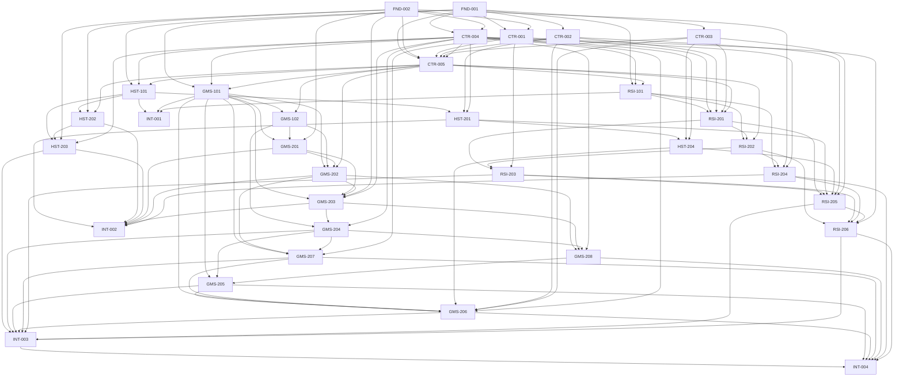

```yaml
document_status: plan
schema_version: rsih-skill-evolution.implementation-plan.v1
system_contract: ./system-contract.md
module_specs:
  host: ./pi-group-chat-host.md
  gms: ./graph-memory-service.md
  rsih: ./rsi-harness.md
language: zh-CN
task_count: 33
```

# RSI Harness Skill Evolution 实施计划

## 1. 总览

### 1.1 范围与实施原则

本计划把 [`system-contract.md`](./system-contract.md)、[`pi-group-chat-host.md`](./pi-group-chat-host.md)、[`graph-memory-service.md`](./graph-memory-service.md)、[`rsi-harness.md`](./rsi-harness.md) 转化为 **恰好 33 个**可独立验收的任务：前置 fixture/Contract 7 个、Host 5 个、GMS 10 个、RSIH 7 个、集成 tracer 4 个。计划只定义实施顺序，不把现有旧测试绿色视为新规范完成，也不把文档示例视为 executable contract。

**Authoring scope**：本次阶段只新增本计划文档，不修改 Host、GMS、RSIH 的任何 WIP 源码、测试、配置或既有四份 spec；下文列出的源码/测试/fixture路径均是未来执行对应 task 时的预期产出，不表示本次已经实施。

统一根路径约定：

- `ROOT=/home/zhoujie22/river2_0`
- `SPEC=$ROOT/memory_graph_evolving/specs/rsi-harness-skill-evolution`
- `FIX=$SPEC/conformance`，是三个仓库共同读取的 **唯一** golden source；Go/TS runner 禁止复制 expected files。
- `HOST=$ROOT/memory_graph_evolving/pi-group-chat-host`
- `GMS=$ROOT/memory_graph_evolving/graph-memory-service`
- `RSIH=$ROOT/RSI-Harness`

并行规则：不同仓库在上游 gates 绿色后天然并行；同仓库仅当 package/file 不重叠时并行。`cmd/*` composition root、GMS OpenAPI、RSIH `src/index.ts`/`src/pi-cli-runtime.ts`/`package.json` 属集成热点，必须串行。每个 Wave 先完成 package-local Red/Green/Refactor，再进入 composition root；不得以 fake boundary 通过代替后续真实集成。

### 1.2 任务总数、并行分组与预计阶段

| 阶段 | 任务 | 并行/分层 | 阶段退出条件 |
|---|---|---|---|
| Wave 0A | FND-001, FND-002 | 完全并行 | JCS/SHA-256 与 Sealed/Q29-B corpus 先冻结；共享 validator 全绿 |
| Wave 0B | CTR-001..004 | 可并行，均消费 0A fixture contract | 四个跨文档 blocker 有版本化决议与负例 |
| Wave 0C | CTR-005 | 串行收口 | DTO/state/policy/profile schemas、单位、限值、preimage 可机器验证 |
| Wave 1 | HST-101, GMS-101, RSI-101 | 三仓并行 | 三 adapter 独立读取同一 `$FIX` 并逐字节/reason parity |
| Wave 2 | GMS-102, RSI-201；INT-001 | A 层前两项并行，B 层 INT-001 | 跨语言 S1 gate 通过；transaction ports 与 authority guards 成立 |
| Wave 3 | HST-201, HST-202, GMS-201, RSI-202 | 跨仓并行；Host 两包不重叠 | same-call/Segment/evidence/static render 基础可测 |
| Wave 4 | HST-203, HST-204, GMS-202, RSI-203, RSI-204 | 跨仓并行；RSIH 两包不重叠 | replay、Explore session、candidate、materializer、fake runtime 可组合 |
| Wave 5 | GMS-203, RSI-205；RSI-206 | A 层前两项并行；B 层 RSI-206 串行接 package scripts | evaluator、Pi registry/lock snapshot、Composite scheduler 全绿 |
| Wave 6 | GMS-204, INT-002；GMS-208 | A 层 release 与 S2-S4 fake-boundary tracer 并行；B 层 merge | S2-S5 记录链可审计；merge 可复用 release transaction |
| Wave 7 | GMS-205, GMS-207 | package 实现可并行；shared integration files 按 GMS-205（projector 接线）→ GMS-207（closure route/OpenAPI）→ GMS-206（retrieval routes/OpenAPI）串行合入 | projector 与权威 closure API 都可服务 |
| Wave 8 | GMS-206；INT-003；INT-004 | A/B/C 层严格串行 | S1-S9 与 MT1-MT6 全链通过并形成证据包 |

“预计阶段”仅指上述 contract-first、adapter、domain pipeline、release/projection、retrieval/integration 阶段，不给日历工期。任何 gate 未绿，后续 capability 保持 disabled/fail closed。

### 1.3 关键路径与可并行旁路

关键路径为：

`FND-001 → CTR-004 → CTR-005 → GMS-101 → GMS-102 → GMS-201 → GMS-202 → GMS-203 → GMS-204 → GMS-208 → GMS-205 → GMS-206 → INT-003 → INT-004`。

并行旁路：

- Host 路：`CTR-005 → HST-101 → HST-202 → HST-203` 与 GMS 主链并行；`FND-002 → HST-202` 是 recorded boundary；`HST-201 → HST-204` 独立推进。
- RSIH 路：`CTR-005 → RSI-101 → RSI-201 → RSI-202 → RSI-203 → RSI-205 → RSI-206` 与 GMS 主链并行；`CTR-001` 直接 gate `RSI-201`/`RSI-203`。
- `INT-001` 在 Wave 2 只等待三语言 adapter；`INT-002` 使用 frozen fake/contract boundary，不等待 production projector/retrieval，但不得宣称 S5+ 完成。

## 2. 前置修复阶段（Wave 0）

### 2.1 Wave 0A — Shared fixtures first

FND-001 与 FND-002 无输入 task dependency，必须先于 Contract 文本修复冻结。冻结含 manifest/case IDs、source、exact canonical bytes/base64、accept/reject 与 expected reason；0B 只能通过追加/版本化 fixture expectation 解决 blocker，不得回写 expected 迎合实现。

- **FND-001**：JCS/SHA-256、refs、DTO/artifact/event/merge 正负 corpus；含逐字节、SHA-256、accept/reject、reason parity。
- **FND-002**：Host Sealed Segment 与 RSIH Q29-B recorded runtime corpus；含 success/failure/recovery、ToolProxyResult、causal links、immutable seals，以及 fake clock/random/tool/provider/fs。

### 2.2 Wave 0B — 四个跨文档 blocker

- **CTR-001** 冻结 `SkillLock.materialization_ref` 到 materialization identity 的唯一映射；明确 digest preimage。严禁把 `bundle_digest` 猜作 manifest digest。
- **CTR-002** 将 Host success validation 改为 tool-specific；解决 `skill_get` closed `GuidanceView` 与 watermark/budget/citations 的冲突。
- **CTR-003** 为 `ExploreResult` 冻结 top-level omitted evidence/Skill refs 及 truncation invariants。
- **CTR-004** 冻结 system reason-code registry policy、GMS/Host-local ownership、precedence、status/retry/same-request/new-attempt 映射。

Readiness：在 CTR-002 通过前 `skill_get` disabled；CTR-003 通过前任何 top-level omission success disabled；CTR-001 及对应 fixture 通过前 S8/MT6 publish/freeze disabled。所有门槛必须返回 closed reason，不得用自由 JSON、UI、日志或 side channel 绕过。

### 2.3 Wave 0C — Machine-readable contract

CTR-005 将共享 DTO、普通 `SkillProposal` event（补足现有事件 schema 缺口）、Composite execution transitions、render/resource/permission/runtime profiles，连同单位、限值与 digest preimage，固化为机器可验证 schema/policy。它只在 0B 全部决议后执行，避免生成器固化冲突语义。

## 3. Wave 1–8 实施安排

### Wave 1 — Shared-contract adapters

HST-101、GMS-101、RSI-101 分别实现 Go Host、Go GMS、TypeScript RSIH adapter/conformance runner；三者直接读取 `$FIX`。禁止 repository-local expected 副本、`json.Marshal` 充当 JCS、仅比较 parsed object 或测试时更新 golden。

### Wave 2 — Cross-language gate 与底层边界

A 层并行 GMS-102 immutable ledgers/transaction ports 与 RSI-201 exact adapter/S-slot/authority guards。B 层 INT-001 等三 adapter 全绿后执行 S1 Go↔TS gate。Wave 内不是“严格同时”；INT-001 明确依赖 HST-101/GMS-101/RSI-101。

### Wave 3 — Same-call、seals、evidence、static render

HST-201 改造 Pi call 内同步 bridge/core；HST-202 建立不可变 Segment close/seals；GMS-201 仅通过 FND-002 contract boundary 接收 seals，故不依赖 HST-202 production implementation；RSI-202 冻结 render profiles/two-phase validation。四项可跨仓并行。

### Wave 4 — Replay 与 materialization 基础

Host scheduler/session、GMS static gates、RSIH materializer与 Q29-B runner 并行。HST-203 与 RSI-204 先通过 shared fake protocol，各自不依赖对方源码；真实组合推迟至 INT-002。RSI-203 的成功 publish 仅在 CTR-001 gate 绿后启用。

### Wave 5 — Evaluator、Pi snapshot、Composite

A 层 GMS-203 与 RSI-205 并行；B 层 RSI-206 消费 RSI-205 immutable registry 并统一更新 `package.json` test script 纳入本计划所有新增 TS tests。RSI-206 之前仍使用定向 `node --test`，不能因 npm script 尚未收口跳过测试。

### Wave 6 — Release、S2-S4 tracer、merge

A 层 GMS-204 与 INT-002 并行：INT-002 使用 fake GMS/Host/RSIH contract boundaries，只验 S2-S4，不假称 production release；B 层 GMS-208 复用已绿色的 release/activation transaction，完成 MT1-MT5 binary Step Guidance subsystem。

### Wave 7 — Projector 与 authoritative closure

GMS-205、GMS-207 package 实现可并行；shared integration files 按 GMS-205（projector 接线）→ GMS-207（closure route/OpenAPI）→ GMS-206（retrieval routes/OpenAPI）串行合入。Graph 不参与 closure authority。

### Wave 8 — Retrieval 与总集成

A 层 GMS-206 完成 Explore/Guidance/tools；B 层 INT-003 贯通 S5-S9；C 层 INT-004 在 INT-003 证明公共 release→projection→retrieval→materialization 路径后贯通 MT1-MT6。最终证据包不得包含 candidate leakage、旁路 tool result 或未锁资源。

## 4. 依赖图

### 4.1 Mermaid



### 4.2 Machine-readable adjacency table

数组列出每个 task 的直接输入依赖；空数组表示“无”。该表是执行器的 dependency source，必须保持 DAG。

```yaml
adjacency:
  FND-001: []
  FND-002: []
  CTR-001: [FND-001, FND-002]
  CTR-002: [FND-001]
  CTR-003: [FND-001]
  CTR-004: [FND-001, FND-002]
  CTR-005: [FND-001, FND-002, CTR-001, CTR-002, CTR-003, CTR-004]
  HST-101: [FND-001, CTR-004, CTR-005]
  HST-201: [HST-101, CTR-002, CTR-004]
  HST-202: [HST-101, FND-002, CTR-005]
  HST-203: [HST-101, HST-202, FND-002, CTR-004]
  HST-204: [HST-201, CTR-003, CTR-004]
  GMS-101: [FND-001, CTR-004, CTR-005]
  GMS-102: [GMS-101, CTR-005]
  GMS-201: [GMS-101, GMS-102, FND-002]
  GMS-202: [GMS-101, GMS-102, GMS-201, CTR-005]
  GMS-203: [GMS-101, GMS-201, GMS-202, FND-002, CTR-004]
  GMS-204: [GMS-102, GMS-203, CTR-004]
  GMS-205: [GMS-101, GMS-204, GMS-208]
  GMS-206: [GMS-101, GMS-205, GMS-207, HST-204, CTR-002, CTR-003, CTR-004]
  GMS-207: [GMS-101, GMS-202, GMS-204, CTR-001]
  GMS-208: [GMS-202, GMS-203, GMS-204, CTR-004]
  RSI-101: [FND-001, CTR-004, CTR-005]
  RSI-201: [RSI-101, CTR-001, CTR-002, CTR-003, CTR-005]
  RSI-202: [RSI-101, RSI-201, CTR-005]
  RSI-203: [RSI-201, RSI-202, CTR-001]
  RSI-204: [RSI-101, RSI-202, FND-002, CTR-004]
  RSI-205: [RSI-201, RSI-203, HST-201, HST-204, CTR-002, CTR-003]
  RSI-206: [RSI-202, RSI-203, RSI-204, RSI-205, CTR-004]
  INT-001: [HST-101, GMS-101, RSI-101]
  INT-002: [HST-201, HST-202, HST-203, GMS-201, GMS-202, GMS-203, RSI-204]
  INT-003: [HST-203, GMS-204, GMS-205, GMS-206, GMS-207, RSI-203, RSI-205, RSI-206]
  INT-004: [INT-003, GMS-205, GMS-206, GMS-207, GMS-208, RSI-204, RSI-206]
```

## 5. 每个 task 详情

以下所有“准确命令”均以 Bash 为例；执行任一命令前先在同一 shell 设置：`export ROOT=/home/zhoujie22/river2_0 HOST=/home/zhoujie22/river2_0/memory_graph_evolving/pi-group-chat-host GMS=/home/zhoujie22/river2_0/memory_graph_evolving/graph-memory-service RSIH=/home/zhoujie22/river2_0/RSI-Harness`。共享 fixture Python tests 一律用 stdlib `unittest discover`，不把含连字符的目录当作 Python module name。

### FND-001 — Shared JCS/SHA-256 golden corpus

- **所属仓库**：共享fixture
- **覆盖/引用**：S1；MT1–MT3 identity cases；Contract §1.3、§6、§7、§8、§9、§13.7、§15.1 S1、§15.2、§16；GMS §12.1；RSIH §10.1。
- **内容概述**：创建唯一 `$FIX` manifest 和 canonicalization/refs/artifacts/events/merge/negative corpus。每 case 固定 source、`canonical.utf8`、base64、expected digest/length/accept/reason；用 Python stdlib validator 校验 UTF-8 no BOM、逐字节、SHA-256、路径与 manifest 完整性。覆盖 Contract §16 的 15 类最低 fixture及 reason parity。
- **输入依赖**：无。
- **产出物**：源码 `$FIX/validate.py`、`$FIX/schema/conformance-manifest.schema.json`；测试 `$FIX/tests/test_validate.py`；fixture `$FIX/{manifest.json,canonicalization,refs,artifacts,events,merge,negative}/**`。
- **完成判据**：validator 无第三方依赖；同 case 重跑 bit-identical；accepted case bytes/digest 精确，rejected case reason 精确；Go/TS 后续可直接读该目录。
- **TDD**：**Red** `$FIX/tests/test_validate.py::test_manifest_requires_exact_bytes_digest_and_reason`，先断言 key-order/Unicode 同 bytes、篡改一字节失败、负例 reason 不匹配失败；**Green** 最小 manifest loader、`hashlib.sha256` 与 byte comparator；**Refactor** 只抽取 fixture I/O/schema checks，不在 validator 重写 JCS 实现。
- **Fail-closed**：non-integer→`NON_INTEGER_NUMBER`；unknown required extension→`UNKNOWN_REQUIRED_EXTENSION`；digest mismatch→`DIGEST_MISMATCH`；naked/latest/Graph ref→`NON_EXACT_REF`；cycle/port/uncommitted evidence/projection gap/permission 各匹配 Contract code；未知 case category、重复 ID、缺 expected、expected 自更新全部失败。
- **准确命令**：`cd "$ROOT" && python3 -m unittest discover -s memory_graph_evolving/specs/rsi-harness-skill-evolution/conformance/tests -p 'test_*.py' && python3 memory_graph_evolving/specs/rsi-harness-skill-evolution/conformance/validate.py --root memory_graph_evolving/specs/rsi-harness-skill-evolution/conformance`。

### FND-002 — Sealed Segment/Q29-B fixture corpus

- **所属仓库**：共享fixture
- **覆盖/引用**：S2–S4、S9、MT4；Contract §7.5–§7.7、§7.10–§7.11、§10.5、§15 S2–S4、§16；Host §3–§6、§9.1–§9.3；RSIH §6.2–§6.7、§10.2/§10.8。
- **内容概述**：冻结 recorded Room/Segment 与 Q29-B fake runtime 数据协议。Sealed corpus 含 success/failure/recovery、一次 exact ToolProxyResult、DAG causal links、frontier、Evidence/Path seals、failed/aborted 无 refs；runtime corpus 固定 clock、random、tool、provider、filesystem、locale/timezone、late output 与调用序列。
- **输入依赖**：无。
- **产出物**：源码 `$FIX/validate_recorded.py`、`$FIX/schema/{sealed-segment,q29b-runtime}.schema.json`；测试 `$FIX/tests/test_recorded.py`；fixture `$FIX/recorded/{segments,q29b}/**`。
- **完成判据**：seal bytes immutable；相同 recorded packet 两次 output digest 相同；任一未声明 fake access失败；failure/recovery 与 late-output cases 均可单独定位。
- **TDD**：**Red** `test_recorded.py::test_q29b_rejects_unsealed_or_nondeterministic_inputs` 断言缺 path、seal 改字节、clock 耗尽、额外 tool call、late output 改 terminal 都失败；**Green** 最小 schema/seal/call-sequence verifier；**Refactor** 分离 recorded data validation 与 runtime semantics，保持 fixture data 无可执行指令。
- **Fail-closed**：DAG cycle/missing causal link、nonterminal tool、mutable seal、fixture family 缺失、真实 clock/random/network/provider/fs、跨 run cache、late output rewrite、candidate 进入 live registry全部拒绝。
- **准确命令**：`cd "$ROOT" && python3 -m unittest discover -s memory_graph_evolving/specs/rsi-harness-skill-evolution/conformance/tests -p 'test_recorded.py' && python3 memory_graph_evolving/specs/rsi-harness-skill-evolution/conformance/validate_recorded.py --root memory_graph_evolving/specs/rsi-harness-skill-evolution/conformance/recorded`。

### CTR-001 — Materialization exact identity

- **所属仓库**：Contract修复
- **覆盖/引用**：S8、MT6；Contract §6.2、§7.19–§7.20、§15 S8/MT6、§16；GMS §12.7/§12.14；RSIH §4.1–§4.5、§9.6、§10.3/§10.10。
- **内容概述**：版本化修订 Contract，新增或冻结 manifest exact identity，使 `SkillLock.materialization_ref` 有唯一 `id/version/digest` 映射；明确 manifest digest preimage、bundle digest 与 materialization identity 的不同角色、session freeze 和 cache lookup。不得把 `bundle_digest` 当 manifest digest。
- **输入依赖**：FND-001、FND-002。
- **产出物**：源码/政策 `system-contract.md` 修订、`$FIX/schema/materialization-identity.schema.json`、`$FIX/validate_materialization_identity.py`；测试 `$FIX/tests/test_materialization_identity.py`；fixture `$FIX/materialization/{identity,lock-closure,negative}/**`。
- **完成判据**：同 manifest identity 唯一；改变任一 preimage 字段改变 digest；bundle bytes、manifest、lock 三层 identity 可交叉验证；旧/新 schema 有明确兼容结论。
- **TDD**：**Red** `test_materialization_identity.py::test_bundle_digest_is_not_manifest_ref_digest` 断言猜填 bundle digest 被拒、manifest 字段变化触发 ref mismatch；**Green** 最小 exact-ref/preimage validator；**Refactor** 共享 Digest/VersionedRef 校验，不把 RSIH 私有目录布局写入 Contract。
- **Fail-closed**：缺 version/manifest digest、bundle/manifest digest 混用、partial manifest、stale sequence、lock closure 少节点、same ref different bytes、unknown required extension 均禁 publish/freeze。
- **准确命令**：`cd "$ROOT" && python3 -m unittest discover -s memory_graph_evolving/specs/rsi-harness-skill-evolution/conformance/tests -p 'test_materialization_identity.py' && python3 memory_graph_evolving/specs/rsi-harness-skill-evolution/conformance/validate_materialization_identity.py --root memory_graph_evolving/specs/rsi-harness-skill-evolution/conformance/materialization`。

### CTR-002 — tool-specific success validation/skill_get conflict

- **所属仓库**：Contract修复
- **覆盖/引用**：S2、S7；Contract §7.15–§7.18、§12.4–§12.7；Host §5.2/§5.6/§7/§9.1/§9.4；GMS §10.5、§11.1、§12.6；RSIH §8.4–§8.6。
- **内容概述**：冻结 success payload 的 tool-specific validation matrix：Explore/Expand 要求 budgets/citations/watermark；`skill_get` 只验证 closed `GuidanceView` 适用字段，并规定 freshness/authorization 由 request与权威 read audit 承载，不向 closed DTO 私添字段。
- **输入依赖**：FND-001。
- **产出物**：源码/政策 `system-contract.md`、`pi-group-chat-host.md`、`graph-memory-service.md` 的版本化协调修订，`$FIX/policy/tool-success-validation.v1.json`、`$FIX/validate_tool_binding.py`；测试 `$FIX/tests/test_tool_binding.py`；fixture `$FIX/tools/{explore,expand,skill-get}/**`。
- **完成判据**：matrix 无矛盾；`skill_get` readiness case 通过后才可 enable；Explore 缺 watermark 仍失败；任何 wrapper/free JSON 失败。
- **TDD**：**Red** `test_tool_binding.py::test_skill_get_closed_guidance_view_is_validated_by_applicable_rules_only`，同时断言 Explore 缺 budgets失败；**Green** 最小 tool-name→result-schema/rule binding；**Refactor** 把共有 schema/digest/scope checks 与 tool-specific checks 分层。
- **Fail-closed**：tool/result type mismatch、GuidanceView 私添 watermark、Explore 缺 citation、free artifact body、未知 tool、required extension、scope越权、旧 profile 尝试启用均返回 closed code。
- **准确命令**：`cd "$ROOT" && python3 -m unittest discover -s memory_graph_evolving/specs/rsi-harness-skill-evolution/conformance/tests -p 'test_tool_binding.py' && python3 memory_graph_evolving/specs/rsi-harness-skill-evolution/conformance/validate_tool_binding.py --policy memory_graph_evolving/specs/rsi-harness-skill-evolution/conformance/policy/tool-success-validation.v1.json`。

### CTR-003 — ExploreResult top-level omitted refs

- **所属仓库**：Contract修复
- **覆盖/引用**：S7；Contract §5.6、§7.15–§7.16、§12.1–§12.6、§15 S7；Host §7/§9.4；GMS §10.8–§10.9、§12.6；RSIH §8.5/§9.6。
- **内容概述**：为 `ExploreResult` 冻结 typed top-level omitted evidence/Skill refs、排序、去重、与 truncation codes/budgets 的一致性；branch omission 继续属于 GuidanceView，不混入 top-level。
- **输入依赖**：FND-001。
- **产出物**：源码/政策 `system-contract.md` 修订、`$FIX/schema/explore-result.schema.json`、`$FIX/validate_explore_omission.py`；测试 `$FIX/tests/test_explore_omission.py`；fixture `$FIX/tools/explore/{top-level-omission,no-omission,negative}/**`。
- **完成判据**：每个 cap-induced omission 可由 exact refs 完整表达；无 omission 时字段语义确定；排序与 fence/budget accounting 可重放。
- **TDD**：**Red** `test_explore_omission.py::test_cap_truncation_requires_exact_top_level_omitted_refs` 断言只有 reason 无 refs失败、evidence/Skill 混类失败；**Green** 最小 schema与 accounting validator；**Refactor** omission list canonicalization 与 ranking 分离。
- **Fail-closed**：silent truncation、omitted ref non-exact/latest/Graph、重复或已服务 ref、wrong result type、budget used不一致、fence不前进、unknown truncation code 均拒绝。
- **准确命令**：`cd "$ROOT" && python3 -m unittest discover -s memory_graph_evolving/specs/rsi-harness-skill-evolution/conformance/tests -p 'test_explore_omission.py' && python3 memory_graph_evolving/specs/rsi-harness-skill-evolution/conformance/validate_explore_omission.py --fixtures memory_graph_evolving/specs/rsi-harness-skill-evolution/conformance/tools/explore`。

### CTR-004 — system reason-code registry policy

- **所属仓库**：Contract修复
- **覆盖/引用**：所有 slices/tracers；Contract §13.2–§13.7；Host §5.8–§5.9、§8；GMS §11.2–§11.5；RSIH §9.1–§9.4。
- **内容概述**：冻结 system registry ownership 和 precedence：GMS/system codes 与 Host-local proxy codes 分权；上游已知 code 可按 policy透传，Host validation失败优先产生 Host-local code；未知 code 不透传。policy 明确 `status`、`retryable`、same-request retry、new-attempt required、terminal 与 inconclusive 映射。
- **输入依赖**：FND-001、FND-002。
- **产出物**：源码/政策 `system-contract.md` 协调条款、`$FIX/policy/{system,host-proxy}-reason-codes.v1.json`、`$FIX/validate_reason_policy.py`；测试 `$FIX/tests/test_reason_policy.py`；fixture `$FIX/reasons/**`。
- **完成判据**：每个 code 唯一 owner/行为；policy JCS digest 固定；Host/GMS/RSIH 对同 failure 得到相同 status/retry/new-attempt；未知 code fail closed。
- **TDD**：**Red** `test_reason_policy.py::test_precedence_status_retry_and_new_attempt_are_total` 断言重复 code、无映射、Host伪造GMS code、按 message 推断均失败；**Green** 最小 totality/ownership validator；**Refactor** code registry 与 transport mapping 分离。
- **Fail-closed**：unknown code、digest mismatch、same-request误重试 stale CAS、semantic failure重试成 pass、late result重写状态、自由 message 驱动 fallback 全部失败。
- **准确命令**：`cd "$ROOT" && python3 -m unittest discover -s memory_graph_evolving/specs/rsi-harness-skill-evolution/conformance/tests -p 'test_reason_policy.py' && python3 memory_graph_evolving/specs/rsi-harness-skill-evolution/conformance/validate_reason_policy.py --policy-dir memory_graph_evolving/specs/rsi-harness-skill-evolution/conformance/policy`。

### CTR-005 — machine-readable DTO/state/policy/profile schemas

- **所属仓库**：Contract修复
- **覆盖/引用**：S1–S9、MT1–MT6；Contract §7–§10、§13–§16；Host §5–§7；GMS §2–§11；RSIH §3–§8、§9.6。
- **内容概述**：提供 closed machine-readable schemas：全部 shared DTO；普通 `SkillProposalEvent`（填补 §9.1 只有状态、无普通事件 DTO 的缺口）；Composite artifact/run/child transition schemas；render/resource/permission/runtime profiles的单位、上下限、整数要求、default materialization 和 digest preimage。生成物带 provenance，手写 schema 为 source of truth。
- **输入依赖**：FND-001、FND-002、CTR-001、CTR-002、CTR-003、CTR-004。
- **产出物**：源码 `$FIX/schema/shared/*.schema.json`、`$FIX/schema/state/*.schema.json`、`$FIX/policy/profiles/*.json`、`$FIX/validate_contract.py`；测试 `$FIX/tests/test_contract_schema.py`；fixture `$FIX/schema-cases/**`。
- **完成判据**：closed core、conditional required fields、state transition totality、profiles 单位/限值/preimage 全可执行；schema version与Contract一致；生成检查无漂移。
- **TDD**：**Red** `test_contract_schema.py::test_all_dto_states_and_profiles_are_closed_and_digestable`，断言普通 proposal非法跳转、Composite终态重开、负数/浮点限值、未定义单位、preimage缺字段失败；**Green** 最小 stdlib schema subset validator/transition checker；**Refactor** schema引用去重但不引入外部依赖或代码生成隐式语义。
- **Fail-closed**：未知 core、unknown required extension、非法 transition、terminal reopen、profile overflow、permission无scope、runtime nondeterminism capability、schema生成漂移、digest preimage不完整全部拒绝。
- **准确命令**：`cd "$ROOT" && python3 -m unittest discover -s memory_graph_evolving/specs/rsi-harness-skill-evolution/conformance/tests -p 'test_contract_schema.py' && python3 memory_graph_evolving/specs/rsi-harness-skill-evolution/conformance/validate_contract.py --root memory_graph_evolving/specs/rsi-harness-skill-evolution/conformance`。

### HST-101 — Go shared-contract adapter/conformance

- **所属仓库**：pi-group-chat-host
- **覆盖/引用**：S1/S2；Contract §6–§7、§13.7、§16；Host §1.1、§5.2/§5.5。
- **内容概述**：实现 Host Go shared DTO adapter、JCS/SHA-256、closed schema/reason loader与 `$FIX` conformance runner；不复用 `encoding/json` 输出作为 canonical bytes。
- **输入依赖**：FND-001、CTR-004、CTR-005。
- **产出物**：源码 `$HOST/internal/contract/{canonical.go,dto.go,reason.go,fixtures.go}`；测试 `$HOST/internal/contract/conformance_test.go`；fixture 直接读取 `$FIX`。
- **完成判据**：逐字节、digest、accept/reject、reason 全匹配；无 expected copy；路径可由 repo root稳定解析。
- **TDD**：**Red** `TestSharedConformance_ExactBytesDigestAndReasons`；断言 Unicode/key order、非整数、unknown extension、non-exact ref；**Green** 最小 decoder/JCS/hash/validator；**Refactor** transport DTO与canonical core分离。
- **Fail-closed**：`json.Marshal` byte shortcut、float、BOM、unknown core、required extension、digest/ref mismatch、Graph/latest、unknown reason policy均失败。
- **准确命令**：`cd "$HOST" && go test ./internal/contract -run '^TestSharedConformance_ExactBytesDigestAndReasons$' -count=1 && go test ./internal/... -count=1`。

### HST-201 — same-call Tool Proxy bridge/core

- **所属仓库**：pi-group-chat-host
- **覆盖/引用**：S2；Contract §7.17–§7.18、§12.7、§15 S2；Host §1.4、§5、§9.1；RSIH §8.4。
- **内容概述**：在 Pi tool future 完成前执行 `Pi→Host proxy→GMS→exact ToolProxyResult→same Pi call`；把 Memory tool 从现有 `tool_execution_end` 后 `handleToolInvocation` 旁路拆出，保留 Room side-effect安全但禁止 placeholder。实现 timeout/cancel/late audit、idempotency lease 与 exact wrapper。
- **输入依赖**：HST-101、CTR-002、CTR-004。
- **产出物**：源码 `$HOST/internal/toolproxy/{service.go,bridge.go,audit.go}`，接线 `$HOST/internal/pi/roombridge/room_bridge.js`、`$HOST/internal/runtime/orchestration.go`；测试 `$HOST/internal/toolproxy/service_test.go`、`$HOST/internal/runtime/tool_proxy_return_test.go`；fixture `$FIX/tools/**`、`$FIX/recorded/q29b/**`。
- **完成判据**：Pi/audit canonical digest相同且 exactly once；fake GMS 在 tool completion前调用；late result只记 audit；旧 post-end path不能宣称成功。
- **TDD**：**Red** `TestToolProxyReturnsExactResultBeforeToolExecutionEnd`、`TestToolProxyLateResultCannotRewriteTerminal`；**Green** 最小 synchronous bridge+terminal CAS；**Refactor** Pi wrapper、proxy core、audit store分层，Room tools不共用 Memory result semantics。
- **Fail-closed**：placeholder、post-end/next-message/UI旁路、schema/digest/scope/budget/watermark错、idempotency conflict、timeout/cancel、late rewrite、未知 upstream code全部 exact failure。
- **准确命令**：`cd "$HOST" && go test ./internal/toolproxy ./internal/runtime ./internal/pi -run '^(TestToolProxyReturnsExactResultBeforeToolExecutionEnd|TestToolProxyLateResultCannotRewriteTerminal)$' -count=1 && go test ./... -count=1`。

### HST-202 — Segment close/seals

- **所属仓库**：pi-group-chat-host
- **覆盖/引用**：S3；Contract §7.5–§7.8、§15 S3；Host §3–§4、§8、§9.2。
- **内容概述**：原子 close open Segment，冻结 frontier/membership、Evidence Seal、Conversation Path Seal、SegmentRef、terminal CheckpointRef及 DAG links；success/failure/recovery 与 ToolProxyResult 均进入 canonical seal；settled后不可追加。
- **输入依赖**：HST-101、FND-002、CTR-005。
- **产出物**：源码 `$HOST/internal/segment/{service.go,seals.go,paths.go}`、store port/adapter；测试 `$HOST/internal/segment/service_test.go`、`$HOST/internal/store/memory/segment_seal_test.go`；fixture `$FIX/recorded/segments/**`。
- **完成判据**：单事务/单CAS返回 refs；reread digest一致；failed/aborted 不产生 refs；append-after-settle失败。
- **TDD**：**Red** `TestCloseSegmentAtomicallySealsSuccessFailureRecovery`、`TestFailedClosePublishesNoRefs`；**Green** 最小 close transaction；**Refactor** path extraction纯函数与 store transaction分离。
- **Fail-closed**：DAG cycle/missing ref、nonterminal delivery/tool、digest错、path family缺失、frontier stale、相同 key不同 input、cancel partial settle、settled mutation全部拒绝。
- **准确命令**：`cd "$HOST" && go test ./internal/segment ./internal/store/memory -run '^(TestCloseSegmentAtomicallySealsSuccessFailureRecovery|TestFailedClosePublishesNoRefs)$' -count=1 && go test ./internal/... -count=1`。

### HST-203 — replay scheduler

- **所属仓库**：pi-group-chat-host
- **覆盖/引用**：S4/S9/MT4；Contract §7.10–§7.11、§9.5、§10.5；Host §6、§9.3；RSIH §6。
- **内容概述**：校验 ReplayRequest/seals/exact refs，冻结 plan、family order、seeds、profiles、permissions与 output capture；调度 baseline/candidate，merge覆盖 A/B/overlap/conflict；仅关联 raw outputs，不评分。
- **输入依赖**：HST-101、HST-202、FND-002、CTR-004。
- **产出物**：源码 `$HOST/internal/replay/{scheduler.go,plan.go,attempt.go}`；测试 `$HOST/internal/replay/scheduler_test.go`；fixture `$FIX/recorded/{segments,q29b}/**`。
- **完成判据**：相同 plan 重跑 output refs稳定；infra retry只新增 attempt；semantic failure不重试；Host 无 U1/release代码。
- **TDD**：**Red** `TestSchedulerFreezesPairedPlanAndAllFixtureFamilies`、`TestSemanticFailureCannotRetryToPass`；**Green** 最小 plan+lease+dispatch ports；**Refactor** scheduling/correlation 与 adapter transport分离。
- **Fail-closed**：unsettled segment、seal mismatch、latest/Graph、missing family、permission超cap、profile unavailable、nondeterminism、late output、source expectation缺失均不产 accepted语义。
- **准确命令**：`cd "$HOST" && go test ./internal/replay -run '^(TestSchedulerFreezesPairedPlanAndAllFixtureFamilies|TestSemanticFailureCannotRetryToPass)$' -count=1 && go test ./... -count=1`。

### HST-204 — ExploreSession/fences

- **所属仓库**：pi-group-chat-host
- **覆盖/引用**：S7；Contract §5.6、§7.15–§7.18、§12；Host §2.3–§2.4、§7、§9.4；GMS §10.2–§10.10。
- **内容概述**：绑定 ExploreSession 到 Room/Agent/profile，clamp budgets/freshness，校验 typed Evidence/Skill、独立 fences/citations、top-level omission与 watermark；retry 不重复消费。
- **输入依赖**：HST-201、CTR-003、CTR-004。
- **产出物**：源码 `$HOST/internal/explore/{session.go,validator.go,fences.go}`；测试 `$HOST/internal/explore/session_test.go`；fixture `$FIX/tools/explore/**`。
- **完成判据**：Memory Agent仅当前 Room；两个 ordinary profiles产生不同授权；Host不rerank/filter；min sequence behind失败；same query exact replay。
- **TDD**：**Red** `TestExploreSessionEnforcesScopeBudgetsFencesAndOmissions`；**Green** 最小 binding/validator/fence CAS；**Refactor** request clamping与 response exact validation分离。
- **Fail-closed**：跨Room/scope、budget超限、missing watermark/citation、mixed fences、stale profile CAS、silent omission、view hash错、late response消费fence、candidate result均整体失败。
- **准确命令**：`cd "$HOST" && go test ./internal/explore -run '^TestExploreSessionEnforcesScopeBudgetsFencesAndOmissions$' -count=1 && go test ./internal/... -count=1`。

### GMS-101 — Go shared-contract/JCS/reason adapter

- **所属仓库**：graph-memory-service
- **覆盖/引用**：S1；Contract §6–§8、§13.7、§16；GMS §1.1、§3.1、§11.3–§11.5、§12.1。
- **内容概述**：实现 GMS Go shared DTO/JCS/reason policy adapter；隔离旧 `internal/domain/skill_artifact.go` wire model和 `json.Marshal` semantic bytes，不伪装兼容。
- **输入依赖**：FND-001、CTR-004、CTR-005。
- **产出物**：源码 `$GMS/internal/contract/{canonical.go,dto.go,reason.go,fixtures.go}`；测试 `$GMS/internal/contract/conformance_test.go`；fixture 直接读 `$FIX`。
- **完成判据**：所有 fixture逐字节/digest/reason匹配；integer-only；reason policy digest可验证；旧 tracer DTO不能进入新 API。
- **TDD**：**Red** `TestContractConformance_JCSDigestAcceptRejectReasonParity`；**Green** 最小 JCS/ref/reason loader；**Refactor** shared contract 与 legacy domain package建防腐层。
- **Fail-closed**：旧字段别名、float、unknown core/required extension、digest/ref mismatch、latest/Graph、unknown reason、policy digest错全部拒绝。
- **准确命令**：`cd "$GMS" && go test ./internal/contract -run '^TestContractConformance_JCSDigestAcceptRejectReasonParity$' -count=1 && go test ./... -count=1 -race -cover`。

### GMS-102 — immutable ledgers/transaction ports

- **所属仓库**：graph-memory-service
- **覆盖/引用**：S3–S6、MT1–MT5；Contract §5.1、§9、§13.1–§13.5；GMS §2、§11.1。
- **内容概述**：定义 append-only ledgers、content store、idempotency、exact CAS、outbox与 atomic transaction ports；先以内存 adapter实现测试语义，但接口明确 durable boundary，替代“HTTP成功后整库 snapshot”作为规范事务的错觉。
- **输入依赖**：GMS-101、CTR-005。
- **产出物**：源码 `$GMS/internal/skillevolution/ledger/{ports.go,transaction.go,memory.go}`；测试 `$GMS/internal/skillevolution/ledger/transaction_test.go`；fixture `$FIX/events/**`。
- **完成判据**：原子 commit/rollback、append-only、idempotency与 multi-head CAS可测试；失败无部分记录；内存实现明确非生产 durability。
- **TDD**：**Red** `TestTransactionRollsBackAllLedgerHeadAndOutboxWrites`；**Green** 最小 mutex-backed transaction adapter；**Refactor** domain transaction 与 storage实现分离，为 durable adapter留 seam。
- **Fail-closed**：same key different digest、stale CAS、duplicate sequence、partial outbox、mutation历史、snapshot persist失败仍报成功、未知 ledger schema全部拒绝。
- **准确命令**：`cd "$GMS" && go test ./internal/skillevolution/ledger -run '^TestTransactionRollsBackAllLedgerHeadAndOutboxWrites$' -count=1 -race && go vet ./... && go build ./...`。

### GMS-201 — evidence admission

- **所属仓库**：graph-memory-service
- **覆盖/引用**：S3；Contract §7.5–§7.8、§13.1；GMS §2.2、§4.2、§12.2。
- **内容概述**：实现 staging→validating→committed/rejected/inconclusive，验证 Host seals、scope、provenance与 canonical payload；commit transaction 原子铸造 EvidenceRef。通过 FND-002 boundary开发，不等待 Host production。
- **输入依赖**：GMS-101、GMS-102、FND-002。
- **产出物**：源码 `$GMS/internal/skillevolution/evidence/{service.go,records.go}`；测试 `$GMS/internal/skillevolution/evidence/service_test.go`；fixture `$FIX/recorded/segments/**`。
- **完成判据**：仅 committed/sealed refs可读；success/failure/recovery provenance完整；staged ID不能投影/提案；幂等 commit稳定。
- **TDD**：**Red** `TestAdmissionCommitsOnlyValidSealedEvidenceAtomically`；**Green** 最小 protected committer；**Refactor** seal resolver、scope policy、transaction分离。
- **Fail-closed**：segment未settled、seal/digest错、path不全、scope越权、uncommitted evidence、重复 key冲突、partial commit、伪造 checkpoint全部不铸 ref。
- **准确命令**：`cd "$GMS" && go test ./internal/skillevolution/evidence -run '^TestAdmissionCommitsOnlyValidSealedEvidenceAtomically$' -count=1 -race && go test ./... -count=1 -race -cover`。

### GMS-202 — artifact/proposal/candidate/Composite static gates

- **所属仓库**：graph-memory-service
- **覆盖/引用**：S4/S9、MT2/MT3；Contract §7.3–§7.12、§8、§9.1/§9.4/§9.5、§10.2；GMS §3–§4、§12.3/§12.8/§12.10–§12.11。
- **内容概述**：实现三 kind canonical gates、普通 proposal event、candidate immutable binding、Composite ports/DAG/retry/failure/permission checks与 merge candidate provenance/conflict closure。
- **输入依赖**：GMS-101、GMS-102、GMS-201、CTR-005。
- **产出物**：源码 `$GMS/internal/skillevolution/{artifact,proposal,candidate,validation}/**/*.go`；测试对应 `*_test.go`；fixture `$FIX/{artifacts,merge,negative}/**`。
- **完成判据**：Candidate不可执行/Runtime；body immutable；普通/merge transition合法；Composite whole packet冻结；model suggestion不能直接 bind。
- **TDD**：**Red** `TestCandidateBindingRequiresCommittedEvidenceAndAllStaticGates`、`TestCompositeRejectsCycleMissingPortAndPermissionOverflow`；**Green** 最小 canonicalizer/validators/transaction；**Refactor** kind validators与 proposal state engine分离。
- **Fail-closed**：unknown extension、kind drift、non-exact/latest/Graph、uncommitted evidence、cycle/missing/incompatible port、unbounded retry、invalid fallback、permission扩大、blocking conflict、candidate mutation/leakage全部拒绝。
- **准确命令**：`cd "$GMS" && go test ./internal/skillevolution/artifact ./internal/skillevolution/proposal ./internal/skillevolution/candidate ./internal/skillevolution/validation -count=1 -race && go vet ./...`。

### GMS-203 — replay canonicalization/evaluator

- **所属仓库**：graph-memory-service
- **覆盖/引用**：S4/S5、MT4；Contract §7.10–§7.12、§10、§15 S4/S5/MT4；GMS §5、§12.3–§12.4/§12.12。
- **内容概述**：冻结 ReplayRequest，校验 Host/RSIH correlation，canonicalize ReplayResult；实现 hard gates、reference envelope与 integer U1 constrained Pareto，不使用 float。
- **输入依赖**：GMS-101、GMS-201、GMS-202、FND-002、CTR-004。
- **产出物**：源码 `$GMS/internal/skillevolution/{replay,evaluator}/**/*.go`；测试 `$GMS/internal/skillevolution/{replay,evaluator}/*_test.go`；fixture `$FIX/recorded/q29b/**`、`$FIX/merge/**`。
- **完成判据**：all families完整；相同 packet result digest相同；A/B critical slices零回归；至少一主维严格改善；cost-only改善拒绝；overflow inconclusive。
- **TDD**：**Red** `TestEvaluatorAppliesHardGatesAndIntegerParetoEnvelope`、`TestReplayNondeterminismIsInconclusive`；**Green** 最小 canonicalizer/comparator；**Refactor** aggregation、checked arithmetic、decision writer分离。
- **Fail-closed**：missing family、baseline swap、digest/correlation错、nondeterminism、critical regression、cost超限/only improvement、overflow、stale head、模型评分、infra success冒充semantic pass全部拒绝/不确定。
- **准确命令**：`cd "$GMS" && go test ./internal/skillevolution/replay ./internal/skillevolution/evaluator -count=1 -race && go test ./... -count=1 -race -cover`。

### GMS-204 — release/activation

- **所属仓库**：graph-memory-service
- **覆盖/引用**：S5；Contract §7.12–§7.14、§9.2、§10.6、§13.1；GMS §2.6/§6、§12.4/§12.13。
- **内容概述**：原子完成 version assignment、Candidate→Released byte equality mapping、active-head CAS、ActivationEvent/sequence、outbox与 proposal terminal event；支持 protected deactivate/reactivate。
- **输入依赖**：GMS-102、GMS-203、CTR-004。
- **产出物**：源码 `$GMS/internal/skillevolution/activation/{service.go,transaction.go}`；测试 `$GMS/internal/skillevolution/activation/service_test.go`；fixture `$FIX/events/{activation,deactivation}/**`。
- **完成判据**：任一步失败无部分 version/head/event/outbox；same key stable；Graph不在事务内；probation不可达。
- **TDD**：**Red** `TestActivationAtomicallyPublishesMappingHeadEventAndOutbox`、`TestStaleCASLeavesNoPartialRelease`；**Green** 最小 transaction；**Refactor** decision guards、version allocator、event builder分离。
- **Fail-closed**：decision非accepted、body mismatch、stale CAS、sequence conflict、partial outbox、kind drift、permission、unauthorized deactivate/reactivate、probation、duplicate version全部失败。
- **准确命令**：`cd "$GMS" && go test ./internal/skillevolution/activation -run '^(TestActivationAtomicallyPublishesMappingHeadEventAndOutbox|TestStaleCASLeavesNoPartialRelease)$' -count=1 -race && go vet ./... && go build ./...`。

### GMS-205 — Runtime projector

- **所属仓库**：graph-memory-service
- **覆盖/引用**：S6、MT1/MT5/MT6；Contract §5.3–§5.4、§9.3、§11、§13.6；GMS §8–§9、§12.5/§12.9/§12.13–§12.14。
- **内容概述**：按连续 source cursors投影 Runtime nodes/branches/typed refs/九关系，原子提交 Graph mutation+cursor/head/watermark；支持 duplicate、gap blocked、rebuild与历史保留；Curation保持 disabled。
- **输入依赖**：GMS-101、GMS-204、GMS-208。
- **产出物**：源码 `$GMS/internal/skillevolution/projector/{service.go,cursors.go,rules.go,rebuild.go}`，接线 `$GMS/cmd/server/main.go`；测试同目录 `*_test.go`；fixture `$FIX/events/**`、`$FIX/merge/**`。
- **完成判据**：从零重建相同；duplicate幂等；gap/同sequence异digest blocked；candidate永不Runtime；deactivate保留历史；两条 derived_from可审计。
- **TDD**：**Red** `TestProjectorCommitsGraphAndWatermarkAtomically`、`TestProjectionGapBlocksWithoutCandidateLeakage`；**Green** 最小 sequential projector；**Refactor** source adapters、relation rules、storage transaction分离。
- **Fail-closed**：gap/conflict、unknown schema/relation、uncommitted evidence endpoint、candidate/rejected endpoint、missing provenance、Graph自创边、watermark超前、CAS stale全部 blocked。
- **准确命令**：`cd "$GMS" && go test ./internal/skillevolution/projector -count=1 -race && go test ./... -count=1 -race -cover`。

### GMS-206 — Explore/Guidance/tools

- **所属仓库**：graph-memory-service
- **覆盖/引用**：S7、MT6；Contract §5.6、§7.14–§7.18、§12；GMS §10–§11、§12.6/§12.14；Host §5/§7。
- **内容概述**：实现 three tool arguments、session/fences、deterministic lexical+graph integer ranking、budgets、Guidance renderer、typed omitted refs、watermark/freshness 与 exact upstream payload；串行注册 routes/OpenAPI/composition root。
- **输入依赖**：GMS-101、GMS-205、GMS-207、HST-204、CTR-002、CTR-003、CTR-004。
- **产出物**：源码 `$GMS/internal/skillevolution/retrieval/**`、`$GMS/internal/httpapi/skill_evolution.go`、`$GMS/openapi/skill-evolution.yaml`、接线 `$GMS/cmd/server/main.go`；测试 `$GMS/internal/skillevolution/retrieval/*_test.go`、`$GMS/internal/httpapi/skill_evolution_contract_test.go`；fixture `$FIX/tools/**`。
- **完成判据**：same input/head/policy/fences同序；caps/omissions/citations/fences/watermark自洽；skill_get仅 gate绿色后启用；OpenAPI/implementation一致。
- **TDD**：**Red** `TestExploreDeterministicallyEnforcesScopeBudgetFenceAndFreshness`、`TestSkillGetUsesFrozenToolSpecificBinding`；**Green** 最小 rank/budget/render/service；**Refactor** core retrieval与 HTTP/legacy tracer隔离。
- **Fail-closed**：scope/budget/fence、top-level silent omission、citation混用、view hash、projection behind/gap、candidate leakage、historical unauthorized、free JSON、unknown tool、stale session/profile全部失败。
- **准确命令**：`cd "$GMS" && go test ./internal/skillevolution/retrieval ./internal/httpapi -count=1 -race && go test ./... -count=1 -race -cover && go vet ./... && go build ./...`。

### GMS-207 — exact materialization closure API

- **所属仓库**：graph-memory-service
- **覆盖/引用**：S8/S9/MT6；Contract §5.3.6、§7.19–§7.20、§8.4、§15 S8/S9/MT6；GMS §8.1、§11.1、§12.7–§12.8/§12.14；RSIH §4.2。
- **内容概述**：从 authoritative active heads/artifact store读取 root与 transitive dependencies/children，返回 canonical bytes、ports、permissions、freeze sequence与 torn-read token；不依赖 Graph watermark追平。
- **输入依赖**：GMS-101、GMS-202、GMS-204、CTR-001。
- **产出物**：源码 `$GMS/internal/skillevolution/materializationread/{service.go,closure.go}`，HTTP adapter `$GMS/internal/httpapi/skill_evolution.go`、OpenAPI `$GMS/openapi/skill-evolution.yaml`、接线 `$GMS/cmd/server/main.go`；测试 `$GMS/internal/skillevolution/materializationread/service_test.go` 与 HTTP contract test `$GMS/internal/httpapi/skill_evolution_contract_test.go`；fixture `$FIX/materialization/**`。
- **完成判据**：ordering独立于 map/arrival；root必须 current active；closure exact完整；head前后变化失败且无猜测；同sequence同响应。
- **TDD**：**Red** `TestClosureReadUsesAuthoritativeHeadsAndRejectsTornSequence`；**Green** 最小 DFS+canonical order+double-check token；**Refactor** artifact resolver、closure walker、transport分离。
- **Fail-closed**：latest/Graph、deactivated/stale root、missing child/dependency、digest mismatch、cycle、permission、unknown extension、torn activation sequence、candidate root均失败。
- **准确命令**：`cd "$GMS" && go test ./internal/skillevolution/materializationread ./internal/httpapi -run '^(TestClosureReadUsesAuthoritativeHeadsAndRejectsTornSequence|TestSkillEvolutionClosureContract)$' -count=1 -race && go vet ./...`。

### GMS-208 — binary Step Guidance merge subsystem

- **所属仓库**：graph-memory-service
- **覆盖/引用**：MT1–MT5；Contract §5.5、§7.21–§7.23、§9.4、§10.3–§10.4、§15.2；GMS §7、§12.9–§12.13。
- **内容概述**：实现 canonical similarity pair、bands、MergeProposal、dedup/group winner、conflict-aware synthesis、candidate binding、bilateral replay handoff、U1 decision，以及复用 GMS-204 完成双 source-head CAS 的 M@1 activation；A/B retained。
- **输入依赖**：GMS-202、GMS-203、GMS-204、CTR-004。
- **产出物**：源码 `$GMS/internal/skillevolution/{similarity,merge}/**/*.go`；测试同目录 `*_test.go`；fixture `$FIX/merge/**`、`$FIX/recorded/q29b/merge/**`。
- **完成判据**：A+B/B+A同 assessment；single winner；blocking conflict无 candidate；all families；M@1两 derived refs、无 supersedes A/B；source change stale无partial。
- **TDD**：**Red** `TestBinaryMergeCanonicalDedupReplayAndDerivedActivation`、`TestMergeSourceHeadChangeIsStaleWithoutPartialActivation`；**Green** 最小 lifecycle+GMS-204 adapter；**Refactor** assessment/admission/synthesis/evaluation/activation orchestration分包。
- **Fail-closed**：below threshold自动admit、uncommitted evidence、cross-kind/n-way、duplicate winner、blocking conflict、permission/port冲突、family缺失、critical regression、source stale、candidate Runtime leakage、source retirement全部拒绝。
- **准确命令**：`cd "$GMS" && go test ./internal/skillevolution/similarity ./internal/skillevolution/merge -count=1 -race && go test ./... -count=1 -race -cover`。

### RSI-101 — TS shared-contract/conformance

- **所属仓库**：RSI-Harness
- **覆盖/引用**：S1；Contract §6–§8、§13.7、§16；RSIH §1.1、§10.1。
- **内容概述**：实现 TS JCS/exact refs/schema/reason policy adapter与 shared fixture runner；直接读 `$FIX`，不复制 expected，不依赖新增 npm package。
- **输入依赖**：FND-001、CTR-004、CTR-005。
- **产出物**：源码 `$RSIH/src/skill-evolution/{canonical.ts,contract.ts,reasons.ts,fixtures.ts}`；测试 `$RSIH/test/skill-evolution-conformance.test.ts`；fixture 直接读 `$FIX`。
- **完成判据**：TS bytes/digest/reason匹配 expected；integer-only与 closed core；最终由 RSI-206 纳入 `package.json` test script。
- **TDD**：**Red** `skill-evolution-conformance.test.ts` test `shared fixtures match exact bytes digest accept and reason`；**Green** 最小 canonicalizer/validator；**Refactor** Node I/O与 pure canonical core分离。
- **Fail-closed**：JS number非安全整数/float、Unicode/key差异、unknown core/required extension、digest/ref mismatch、latest/Graph、unknown reason policy全部拒绝。
- **准确命令**：`cd "$RSIH" && node --experimental-strip-types --test test/skill-evolution-conformance.test.ts`。

### RSI-201 — exact adapter/S-slot/authority guards

- **所属仓库**：RSI-Harness
- **覆盖/引用**：S8/S9、MT1–MT3/MT5 boundary；Contract §3.3–§3.4、§7.3–§7.4、§14；RSIH §2.6、§3、§9.1、§10.5–§10.7/§10.9。
- **内容概述**：建立 exact active ref resolver、S-slot binding、authority no-op guards；Candidate、Graph/name/latest不能 live bind；Similarity/proposal/synthesis/decision/activation误路由零 shared writes。
- **输入依赖**：RSI-101、CTR-001、CTR-002、CTR-003、CTR-005。
- **产出物**：源码 `$RSIH/src/skill-evolution/{adapter.ts,binding.ts,authority-guards.ts}`；测试 `$RSIH/test/skill-exact-binding.test.ts`；fixture `$FIX/{refs,materialization,merge}/**`。
- **完成判据**：binding digest承诺 exact ref+lock；Composite control不可 patch override；五类 GMS authority请求均拒绝且 runner/materializer未调用。
- **TDD**：**Red** test `S-slot accepts only released exact locked refs and guards GMS authority`；**Green** 最小 resolver/binding/guard；**Refactor** live binding与 replay candidate channel类型隔离。
- **Fail-closed**：candidate、latest/name/Graph、stale lock、digest mismatch、patch-local child/control、RSIH自评/自激活、误路由 merge mutation全部失败。
- **准确命令**：`cd "$RSIH" && node --experimental-strip-types --test test/skill-exact-binding.test.ts`。

### RSI-202 — render profiles/two-phase static validation

- **所属仓库**：RSI-Harness
- **覆盖/引用**：S4/S8/S9；Contract §8、§9.5、§13.3、§14.2；RSIH §3.3、§4.3–§4.4、§5、§9.3。
- **内容概述**：按 exact profile deterministic render三 kind；实现 closure preflight 与 staged full validation，检查 schema/digest/extensions/permission/ports/DAG/retry/fallback/path/resource limits及二次 render一致。
- **输入依赖**：RSI-101、RSI-201、CTR-005。
- **产出物**：源码 `$RSIH/src/skill-evolution/{render,validation}/**/*.ts`；测试 `$RSIH/test/skill-static-validation.test.ts`；fixture `$FIX/{artifacts,negative,policy/profiles}/**`。
- **完成判据**：preflight不冒充 full pass；render bytes/profile digest稳定；所有限值有单位；pure/no network-clock-random-model。
- **TDD**：**Red** test `two-phase validation rejects invalid closure before publish and rerenders bit-identically`；**Green** 最小 renderer/preflight/full report；**Refactor** kind renderers、path/permission/resource checks分离。
- **Fail-closed**：digest/unknown extension、permission overflow、cycle/missing port、invalid retry/fallback、path traversal/collision/symlink、limit exceeded、nondeterminism、candidate live input全部拒绝。
- **准确命令**：`cd "$RSIH" && node --experimental-strip-types --test test/skill-static-validation.test.ts`。

### RSI-203 — materializer/publisher/SkillLock

- **所属仓库**：RSI-Harness
- **覆盖/引用**：S8/MT6；Contract §7.19–§7.20、§15 S8/MT6；GMS §12.7/§12.14；RSIH §4、§10.3/§10.10。
- **内容概述**：消费 authoritative closure，deterministic staging、manifest/lock、fsync-equivalent复核、content-addressed atomic publish 与 one-session freeze；CTR-001 gate未绿时只运行 disabled负例。
- **输入依赖**：RSI-201、RSI-202、CTR-001。
- **产出物**：源码 `$RSIH/src/skill-evolution/materializer/{closure.ts,materializer.ts,publisher.ts,lock.ts}`；测试 `$RSIH/test/skill-materialization.test.ts`；fixture `$FIX/materialization/**`。
- **完成判据**：same input/profile/sequence同 bundle/manifest/lock；partial publish不可见；cache hit全量复核；session只freeze一次。
- **TDD**：**Red** test `materializer atomically publishes exact closure and freezes one SkillLock`、`materialization stays disabled without frozen identity`；**Green** 最小 staging+atomic rename/CAS；**Refactor** render、validation、filesystem publisher、lock service分离。
- **Fail-closed**：bundle/manifest identity混用、stale/torn head、missing/cycle、digest/permission、path/symlink/hardlink/TOCTOU、quota、partial I/O、same address different bytes、stale CAS全部零publish。
- **准确命令**：`cd "$RSIH" && node --experimental-strip-types --test test/skill-materialization.test.ts`。

### RSI-204 — HarnessRunner/Q29-B fake runtime

- **所属仓库**：RSI-Harness
- **覆盖/引用**：S4、MT4；Contract §7.10–§7.11、§10.5；Host §6/§9.3；RSIH §6、§10.2/§10.8。
- **内容概述**：实现 live/replay隔离、Q29-B loader、fake clock/random/tool/provider/fs、paired workdir/cache/session/sink、raw immutable outputs与 bounded infra attempts；不生成 ReplayResult/U1。
- **输入依赖**：RSI-101、RSI-202、FND-002、CTR-004。
- **产出物**：源码 `$RSIH/src/skill-evolution/runner/{runner.ts,fixture.ts,fake-runtime.ts,raw-output.ts}`；测试 `$RSIH/test/skill-replay.test.ts`；fixture `$FIX/recorded/q29b/**`。
- **完成判据**：同 packet bit-identical；执行顺序互换不变；全 families；ambient/network/credential隔离；late output不改 terminal。
- **TDD**：**Red** test `Q29-B paired replay is isolated deterministic and complete`；**Green** 最小 fake adapters+sequential paired runner；**Refactor** capability adapters与 orchestration/capture分离。
- **Fail-closed**：未声明 clock/random/tool/provider/fs、network、HOME/ambient cache、family缺失、cross-contamination、semantic retry、adapter crash、late output、candidate进入 live模式全部失败/不确定。
- **准确命令**：`cd "$RSIH" && node --experimental-strip-types --test test/skill-replay.test.ts`。

### RSI-205 — exact registry/lock-backed snapshot/Pi integration

- **所属仓库**：RSI-Harness
- **覆盖/引用**：S2/S7/S8；Contract §7.18–§7.20、§12.7；Host §5；RSIH §2.3–§2.6、§8、§9.6。
- **内容概述**：从 SkillLock 构造 immutable resolved registry，统一 inline/file-backed Genome-owned source到 locked bundle；迁移 `rsih.genome` 为 lock-backed snapshot并在 projection前复核；Pi 0.84.3 same-call、resource/command、resume/isolation fixtures；skill_get/top-level omission gates按 Contract控制。
- **输入依赖**：RSI-201、RSI-203、HST-201、HST-204、CTR-002、CTR-003。
- **产出物**：源码 `$RSIH/src/skill-evolution/{resource-registry.ts,pi-adapter.ts,snapshot.ts}`，接线 `$RSIH/src/pi-cli-runtime.ts`、`$RSIH/src/harness/pi-projection.ts`；测试 `$RSIH/test/skill-pi-integration.test.ts`；fixture `$FIX/tools/**`、`$FIX/materialization/**`。
- **完成判据**：Genome-owned execution唯一来自 bundle；resume先验 lock/bundle/files；ambient分域且 replay关闭；same-call exact result；legacy snapshot明确 `legacy_unlocked`。
- **TDD**：**Red** test `Pi 0.84.3 loads one lock-backed source and resumes only after digest validation`；**Green** 最小 registry/snapshot adapter；**Refactor** Pi-specific hook与 registry core分离。
- **Fail-closed**：inline/file/ambient collision、mutable source path、lock/session/baseDirectory mismatch、candidate/latest/Graph、skill_get gate未绿、top-level omission旧schema、placeholder/post-end/late result、Node/Pi版本漂移全部禁 v1。
- **准确命令**：`cd "$RSIH" && node --experimental-strip-types --test test/skill-pi-integration.test.ts`。

### RSI-206 — deterministic Composite scheduler

- **所属仓库**：RSI-Harness
- **覆盖/引用**：S9、MT6；Contract §8.4、§9.5、§13.3、§14.2、§15 S9；RSIH §7、§10.4/§10.10。
- **内容概述**：执行 locked exact children、deterministic ready ordering、named port schema/mapping、bounded retry与 declared fallback、permission enforcement、causal trace；whole replay而非 ablation决定资格。串行更新 `src/index.ts` 和 `package.json`，将本计划新增七个 TS test files全部纳入 `test` script。
- **输入依赖**：RSI-202、RSI-203、RSI-204、RSI-205、CTR-004。
- **产出物**：源码 `$RSIH/src/skill-evolution/composite/{scheduler.ts,ports.ts,trace.ts}`、`$RSIH/src/index.ts`、`$RSIH/package.json`；测试 `$RSIH/test/skill-composite.test.ts` 加 RSI-101..205 六个 test files；fixture `$FIX/artifacts/composite/**`、`$FIX/recorded/q29b/composite/**`。
- **完成判据**：同 lock/profile/seeds同 schedule/output；all child attempts保留；权限逐 capability enforce；child ref变化要求新 revision/lock；`npm run check`运行全部新增 tests。
- **TDD**：**Red** test `Composite schedules exact ready children deterministically with bounded handlers`；**Green** 最小串行 topological scheduler；**Refactor** 可选并行策略仅在可证明 deterministic/isolation后加入，ports/retry/permissions分层。
- **Fail-closed**：cycle、missing/incompatible port、unready child、dynamic/latest child、unknown reason/action、retry超限、invalid fallback、permission overflow、shared side-effect nondeterminism、late child output、ablation替代whole replay全部拒绝。
- **准确命令**：`cd "$RSIH" && node --experimental-strip-types --test test/skill-composite.test.ts && npm run check`。

### INT-001 — S1 Go↔TS conformance gate

- **所属仓库**：共享fixture
- **覆盖/引用**：S1；Contract §6、§15 S1、§16；Host §5.5；GMS §12.1；RSIH §10.1。
- **内容概述**：编排 Host Go、GMS Go、RSIH TS 对同 manifest 的结果，比较 canonical bytes base64、digest、accept/reject、reason；结果写临时证据目录，不更新 golden。
- **输入依赖**：HST-101、GMS-101、RSI-101。
- **产出物**：源码 `$FIX/integration/run_s1.py`；测试 `$FIX/integration/tests/test_run_s1.py`；fixture `$FIX/{manifest.json,canonicalization,refs,artifacts,events,merge,negative}/**`。
- **完成判据**：三方 case set相等且每字段 parity；任一 adapter skip/copy expected失败；输出含 toolchain versions。
- **TDD**：**Red** `test_run_s1.py::test_detects_byte_digest_accept_and_reason_divergence`；**Green** 最小 subprocess JSON report comparator；**Refactor** runner invocation与 report comparison分离。
- **Fail-closed**：case缺失、byte-only/digest-only比较、reason alias、expected copy、toolchain mismatch、unknown schema、nondeterministic rerun全部 gate红。
- **准确命令**：`cd "$ROOT" && python3 -m unittest discover -s memory_graph_evolving/specs/rsi-harness-skill-evolution/conformance/integration/tests -p 'test_run_s1.py' && python3 memory_graph_evolving/specs/rsi-harness-skill-evolution/conformance/integration/run_s1.py --host memory_graph_evolving/pi-group-chat-host --gms memory_graph_evolving/graph-memory-service --rsih RSI-Harness --fixtures memory_graph_evolving/specs/rsi-harness-skill-evolution/conformance`。

### INT-002 — S2-S4 Host/GMS/RSIH tracer

- **所属仓库**：共享fixture
- **覆盖/引用**：S2–S4；Contract §15 S2–S4；Host §9.1–§9.3；GMS §12.2–§12.3；RSIH §10.2。
- **内容概述**：用 contract fake boundaries 跑 same-call ToolProxy、Segment settle/seals、evidence commit、candidate validation、frozen scheduling、Q29-B paired raw output与 GMS ReplayResult。明确不含 production S5 release。
- **输入依赖**：HST-201、HST-202、HST-203、GMS-201、GMS-202、GMS-203、RSI-204。
- **产出物**：源码 `$FIX/integration/run_s2_s4.py`；测试 `$FIX/integration/tests/test_s2_s4.py`；fixture `$FIX/recorded/**`、`$FIX/tools/**`。
- **完成判据**：权威链 `Host Tool/DAG/Seal → GMS Evidence/Candidate/ReplayRequest → Host Plan → RSIH raw → GMS ReplayResult` exact可追踪；Pi bytes=audit bytes；后续 transcript不影响 replay。
- **TDD**：**Red** test `tracer rejects post-end result unsealed evidence and nondeterministic replay`；**Green** 最小 process adapters/correlation verifier；**Refactor** fake boundary与真实 command adapters可替换。
- **Fail-closed**：post-end/placeholder、late rewrite、mutable seal、uncommitted evidence、candidate live leakage、missing family、cross-run contamination、nondeterminism、Host/RSIH评分、digest mismatch全部红。
- **准确命令**：`cd "$ROOT" && python3 -m unittest discover -s memory_graph_evolving/specs/rsi-harness-skill-evolution/conformance/integration/tests -p 'test_s2_s4.py' && python3 memory_graph_evolving/specs/rsi-harness-skill-evolution/conformance/integration/run_s2_s4.py --host memory_graph_evolving/pi-group-chat-host --gms memory_graph_evolving/graph-memory-service --rsih RSI-Harness --fixtures memory_graph_evolving/specs/rsi-harness-skill-evolution/conformance`。

### INT-003 — S5-S9 release→projection→retrieval→materialization→Composite tracer

- **所属仓库**：共享fixture
- **覆盖/引用**：S5–S9；Contract §9–§15；Host §9.3–§9.4；GMS §12.4–§12.8；RSIH §10.3–§10.4。
- **内容概述**：从 accepted replay开始，贯通 atomic release/activation、async projector、Explore same-call、authoritative closure、bundle/manifest/lock、Pi registry与 whole Composite replay；分别保留 ledger与派生记录。
- **输入依赖**：HST-203、GMS-204、GMS-205、GMS-206、GMS-207、RSI-203、RSI-205、RSI-206。
- **产出物**：源码 `$FIX/integration/run_s5_s9.py`；测试 `$FIX/integration/tests/test_s5_s9.py`；fixture `$FIX/{events,tools,materialization,artifacts/composite,recorded/q29b/composite}/**`。
- **完成判据**：release事务无partial；projector duplicate/gap；Explore exact到Pi；closure不经Graph；lock identity正确；Composite exact children/ports/permissions/whole replay通过。
- **TDD**：**Red** test `tracer rejects partial release projection gap stale closure and partial publish`；**Green** 最小 staged tracer；**Refactor** 每 slice evidence collector分离并由总 manifest引用。
- **Fail-closed**：hard gate/U1失败、stale CAS、body mismatch、candidate leakage、projection gap/behind、scope/budget/fence、latest/Graph closure、digest/permission、partial publish、port/cycle/nondeterminism全部红。
- **准确命令**：`cd "$ROOT" && python3 -m unittest discover -s memory_graph_evolving/specs/rsi-harness-skill-evolution/conformance/integration/tests -p 'test_s5_s9.py' && python3 memory_graph_evolving/specs/rsi-harness-skill-evolution/conformance/integration/run_s5_s9.py --host memory_graph_evolving/pi-group-chat-host --gms memory_graph_evolving/graph-memory-service --rsih RSI-Harness --fixtures memory_graph_evolving/specs/rsi-harness-skill-evolution/conformance`。

### INT-004 — MT1-MT6 merge tracer

- **所属仓库**：共享fixture
- **覆盖/引用**：MT1–MT6；Contract §5.5、§9.4、§10.3–§10.4、§15.2；GMS §7/§12.9–§12.14；RSIH §10.5–§10.10。
- **内容概述**：贯通 canonical SimilarityAssessment、single winner proposal、conflict-aware candidate、A/B/overlap/conflict replay、U1、dual source-head CAS、M@1、projection/retrieval与 merged bundle/lock；验证 A/B retained。
- **输入依赖**：INT-003、GMS-205、GMS-206、GMS-207、GMS-208、RSI-204、RSI-206。
- **产出物**：源码 `$FIX/integration/run_mt1_mt6.py`；测试 `$FIX/integration/tests/test_mt1_mt6.py`；fixture `$FIX/merge/**`、`$FIX/recorded/q29b/merge/**`、`$FIX/materialization/**`。
- **完成判据**：权威链 assessment→proposal/events→candidate→replay/decision→activation；M有两 derived_from；A/B/M Runtime可见；candidate不可见；S8 identity用于 MT6 lock。
- **TDD**：**Red** test `merge tracer enforces bilateral replay source CAS retention and locked materialization`；**Green** 最小 end-to-end orchestrator；**Refactor** MT阶段证据与公共 S5-S8 adapter复用。
- **Fail-closed**：below threshold自动admit、duplicate winner、blocking conflict、uncommitted evidence、missing family/critical regression、cost-only improvement、source stale、partial M activation、candidate leakage、source retirement、projection gap、lock identity猜测全部红。
- **准确命令**：`cd "$ROOT" && python3 -m unittest discover -s memory_graph_evolving/specs/rsi-harness-skill-evolution/conformance/integration/tests -p 'test_mt1_mt6.py' && python3 memory_graph_evolving/specs/rsi-harness-skill-evolution/conformance/integration/run_mt1_mt6.py --gms memory_graph_evolving/graph-memory-service --rsih RSI-Harness --fixtures memory_graph_evolving/specs/rsi-harness-skill-evolution/conformance`。

## 6. 集成验收

### 6.1 Readiness gates

1. **`skill_get`**：CTR-002 fixture、HST-201、HST-204、GMS-206、RSI-205 与 S2/S7 tracer 全绿前 disabled/fail closed；禁止 `GuidanceView` 私添字段或套假 `ExploreResult`。
2. **Top-level omission**：CTR-003 schema/fixture 与三端 validation 全绿前，任何因 total/evidence/Skill cap 省略 top-level 结果的请求必须失败；禁止 silent success truncation。
3. **S8/MT6 materialization identity**：CTR-001及其materialization fixture、GMS-207、RSI-203 全绿前成功 publish/freeze disabled；`bundle_digest` 永不猜作 manifest/materialization-ref digest。
4. **S2 same-call**：HST-201 与 Pi 0.84.3 behavior fixtures未绿前不得注册/广告 Memory/Skill retrieval。
5. **Profiles**：CTR-005 未绿前 render/resource/permission/runtime profiles不可作为 exact release evidence。

### 6.2 S1–S9 逐条跑通标准

| Slice | 跑通标准 | 权威记录链 | 禁止旁路 |
|---|---|---|---|
| S1 | Go Host/GMS 与 TS 对全部 case exact bytes、SHA-256、accept/reject、reason一致 | fixture manifest/expected → 三 runner report | parsed-object-only、复制 expected、更新 golden迎合实现 |
| S2 | Pi 同一次 call 收到 exactly one ToolProxyResult，bytes/digest等于 Host delivered audit | Host tool_call→request audit→upstream→result→Delivery terminal | placeholder、post-end、next message、UI/log、late rewrite |
| S3 | settled Segment同时产 seals/refs/checkpoint，含 success/failure/recovery/Tool result且不可变 | Host Room sequence/DAG→close transaction→seals/refs | 动态 transcript重建、failed/aborted partial refs |
| S4 | same frozen inputs跑 baseline/candidate/all families并 bit-identical；GMS才铸 ReplayResult | GMS request→Host plan/attempt→RSIH raw→GMS ReplayResult | live traffic、模型/Host/RSIH评分、semantic retry成pass |
| S5 | hard gates+U1+body equality+CAS后原子 release；失败零partial | validation/replay→ReleaseDecision→mapping/head/Event/outbox | accepted decision直接当active、Graph同事务、partial version |
| S6 | 连续投影、duplicate幂等、gap blocked、历史保留、candidate不泄漏 | activation/outbox/source records→projection tx→watermark | Graph当权威、越gap、Curation伪支持、删除历史 |
| S7 | scope、deterministic order、caps、typed omissions、separate fences/citations、watermark到Pi | Host session/profile→GMS query/fence audit→ExploreResult→ToolProxyResult | Host rerank/filter、silent omission、跨Room、旧watermark冒充 |
| S8 | authoritative closure→deterministic files→manifest exact identity→atomic bundle→session lock | GMS active head/artifacts/sequence→RSIH validation/publish/lock | Graph/latest/source path、bundle digest猜ref、partial publish/hot refresh |
| S9 | exact active children、ports/DAG/permissions、static+whole replay、deterministic run | Composite candidate/release→closure/lock→scheduler trace→ReplayResult | dynamic child、patch control override、ablation替代whole replay |

### 6.3 MT1–MT6 逐条跑通标准

| Tracer | 跑通标准 | 权威记录链 | 禁止旁路 |
|---|---|---|---|
| MT1 | A+B/B+A同 pair/assessment；below threshold不admit；similar_to有source record | GMS features/evidence/policy→SimilarityAssessment→projector edge | RSIH/model打分、similarity传递identity/permission |
| MT2 | exact proposal、dedup keys、并发仅一 group winner，duplicate指 canonical winner | assessment→MergeProposal→admission event/group CAS | n-way/cross-kind、两个winner、proposal进入Runtime |
| MT3 | frozen双端 evidence/branches/conflicts；protected bind唯一 CandidateRef | proposal/events→synthesis attempts→candidate binding | 模型解决blocking conflict/绑定candidate、修改A/B |
| MT4 | A/B/overlap/conflict全跑；双端零critical regression；envelope主维严格改善 | ReplayRequest→Host/RSIH outputs→ReplayResult→ReleaseDecision | missing family、score替代replay、cost-only release |
| MT5 | 双 source-head CAS后原子M@1；两 derived refs；A/B retained，无 supersedes A/B | accepted decision→merge activation tx→M event/outbox | stale自动rebase、partial M、retire/deprefer sources |
| MT6 | projector后 A/B/M 可检索，candidate不可见；M authoritative closure→bundle/lock | M activation→projection/watermark→Explore→GMS closure→RSIH lock | candidate leakage、Graph closure、projection gap、identity猜测 |

### 6.4 总命令与证据包

实施完成后的总验收命令（测试可写 `/tmp`/工具 cache，但不得更新 fixture expected）：

```bash
cd "$ROOT" && \
python3 -m unittest discover -s memory_graph_evolving/specs/rsi-harness-skill-evolution/conformance/tests -p 'test_*.py' && \
python3 -m unittest discover -s memory_graph_evolving/specs/rsi-harness-skill-evolution/conformance/integration/tests -p 'test_*.py' && \
python3 memory_graph_evolving/specs/rsi-harness-skill-evolution/conformance/validate_contract.py --root memory_graph_evolving/specs/rsi-harness-skill-evolution/conformance && \
python3 memory_graph_evolving/specs/rsi-harness-skill-evolution/conformance/integration/run_s1.py --host memory_graph_evolving/pi-group-chat-host --gms memory_graph_evolving/graph-memory-service --rsih RSI-Harness --fixtures memory_graph_evolving/specs/rsi-harness-skill-evolution/conformance && \
python3 memory_graph_evolving/specs/rsi-harness-skill-evolution/conformance/integration/run_s2_s4.py --host memory_graph_evolving/pi-group-chat-host --gms memory_graph_evolving/graph-memory-service --rsih RSI-Harness --fixtures memory_graph_evolving/specs/rsi-harness-skill-evolution/conformance && \
python3 memory_graph_evolving/specs/rsi-harness-skill-evolution/conformance/integration/run_s5_s9.py --host memory_graph_evolving/pi-group-chat-host --gms memory_graph_evolving/graph-memory-service --rsih RSI-Harness --fixtures memory_graph_evolving/specs/rsi-harness-skill-evolution/conformance && \
python3 memory_graph_evolving/specs/rsi-harness-skill-evolution/conformance/integration/run_mt1_mt6.py --gms memory_graph_evolving/graph-memory-service --rsih RSI-Harness --fixtures memory_graph_evolving/specs/rsi-harness-skill-evolution/conformance && \
(cd memory_graph_evolving/pi-group-chat-host && go test ./... -count=1) && \
(cd memory_graph_evolving/graph-memory-service && go test ./... -count=1 -race -cover && go vet ./... && go build ./...) && \
(cd RSI-Harness && npm run check)
```

证据包写入 runner 指定的临时/CI artifact 目录，不提交为新的 golden source。至少包含：contract/schema/policy digests；fixture manifest digest；toolchain/Pi/Node版本；三端 S1 reports；Host DAG/seals/tool audits；GMS ledger/event/outbox/projection/reason-policy refs；RSIH validation/raw trace/manifest/lock digests；每个 S/MT 的 pass/fail与关联 exact refs；明确的 disabled gates 列表。证据包不得保存 secret、ambient HOME内容或未授权 evidence正文。

## 7. 风险与未决项

| 风险/未决项 | 现状与影响 | 控制措施/关闭任务 |
|---|---|---|
| Host `post-tool_execution_end` 架构 | `internal/runtime/orchestration.go` 当前在 completion后才调用真实 Memory side effect，直接阻塞 S2/S7 | HST-201 重构 same-call bridge；INT-002 验 bytes/digest与无旁路；旧“completion后副作用”测试须按 Room/Memory语义拆分 |
| GMS 旧 `json.Marshal`/旧 tracer | exploration/navigation/snapshot仍用普通 JSON；OpenAPI 为 `1.0.0-tracer`，旧 DTO wire-incompatible | GMS-101 防腐层；GMS-206/207 新版 OpenAPI；INT-001逐字节，不原地假装兼容 |
| RSIH legacy snapshot与三来源资源 | `rsih.genome` 未重验 digest/lock，inline/file-backed/ambient可碰撞漂移 | RSI-205 lock-backed snapshot/registry；legacy标记；replay隔离 ambient |
| Pi `0.84.3` / Node `>=22.19` | 仅对当前 exact Pi packages与 Node下界声明 conformance；升级可能改变 hooks/same-call/resume | RSI-205冻结 behavior fixtures；版本变化强制重跑 S2/S7/S8/S9 |
| profile 未冻结 | render/resource/permission/runtime 的 schema、单位、限值、digest preimage当前是 blocker | CTR-005 先冻结；未冻结则 validation/materialization/replay fail closed |
| shared schema生成漂移 | 多语言生成器可能各自解释 optional/default/enum | source schema只在 `$FIX`；CI 重新生成后 diff/identity check；禁止提交多份 expected；CTR-005/INT-001关闭 |
| transaction store目前内存 | mutex与整库 snapshot不能证明 durable append-only/atomic outbox；HTTP已响应后 persist失败风险 | GMS-102先定义 durable ports并明确内存 adapter非生产；生产 durable adapter/故障注入是 release gate，不以 unit atomicity替代 durability |
| 跨仓 fixture 路径/CI | 三仓可能独立 checkout，硬编码相对路径易失效 | CI显式 checkout contract artifact并传 `RSIH_SKILL_EVOLUTION_CONFORMANCE_DIR`/等价配置；source仍唯一；fixture digest入证据包 |
| Contract identity/profile后续版本 | CTR-001/005 的决议会改变 schema version；旧 artifact/session兼容策略尚需显式决定 | 只做版本化迁移，不原地改历史；旧 lock无法证明则 legacy/fail closed，不自动升级 |
| GMS composition root/OpenAPI热点 | Wave 7/8 多 task会碰 `cmd/server/main.go`/OpenAPI | package并行、composition root串行；GMS-205→GMS-207→GMS-206集成顺序固定 |
| RSIH package script热点 | 新 test若只用定向命令，最终 `npm test`可能漏跑 | RSI-206 一次性把七个新增 test files写入 `package.json`，最终 `npm run check` |
| 旧测试绿色误判 | 现有测试冻结旧 semantics（尤其 Host completion后副作用、GMS tracer、RSIH snapshot） | 每 task必须先有本计划命名的新 Red；最终只认 shared fixture与 S/MT evidence，不把旧 suite绿色等同新spec完成 |
| Tool-specific/omission readiness | 跨文档修复落地前容易被“临时 wrapper”绕开 | CTR-002/003 与 readiness gates；wrapper/free JSON/silent truncation负例必须常驻 |
| materialization身份 | 最危险误实现是把 bundle digest猜为 manifest ref digest | CTR-001唯一决议与 fixture；RSI-203/INT-003/INT-004均含显式反例 |

未决但不允许实现自行决定的事项：生产 durable store 技术选型；独立发布时共享 contract artifact 的分发机制；profile 的具体数值上限；Pi/Node升级节奏；历史 legacy session 的保留期限。它们可以形成后续 ADR/policy version，但在冻结前必须保持对应 capability disabled/fail closed，不得用默认值、OS资源、自由文本或“当前测试通过”代替决议。
