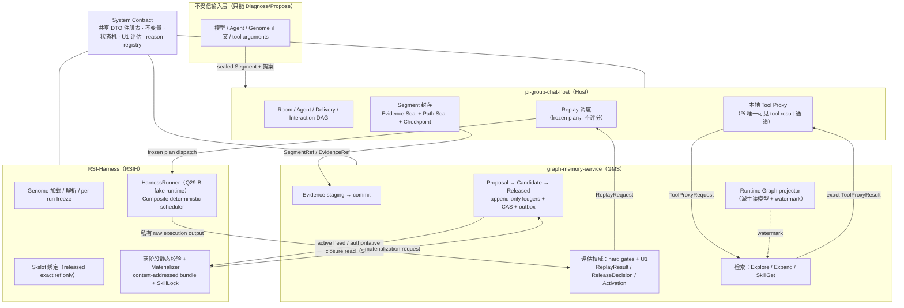
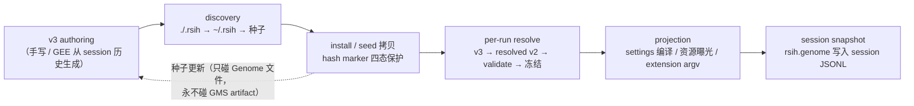
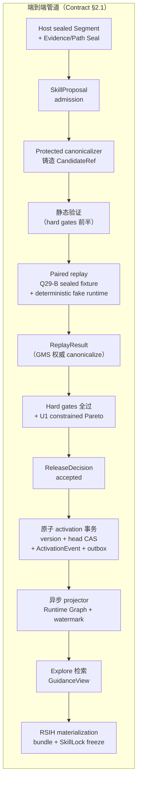
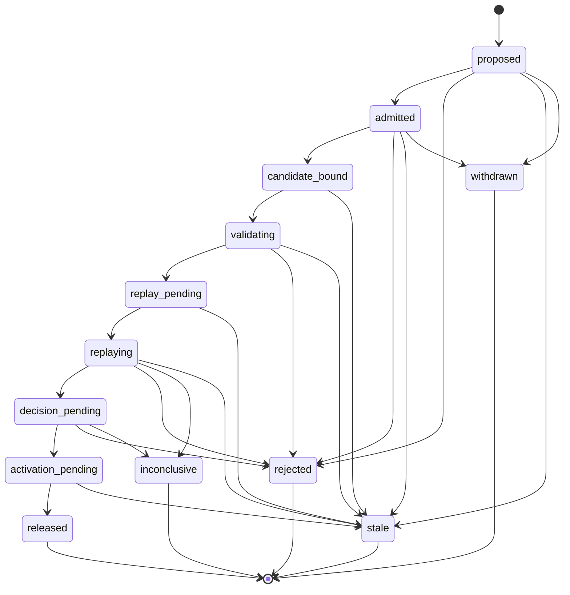
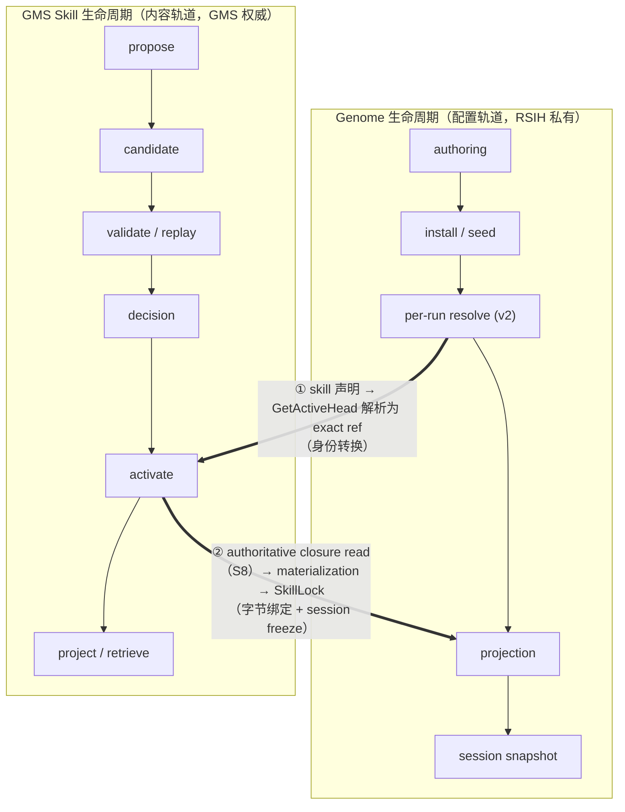
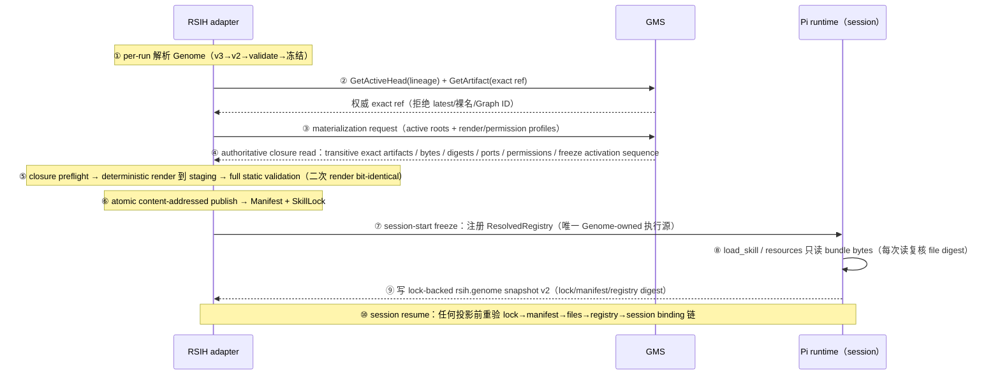
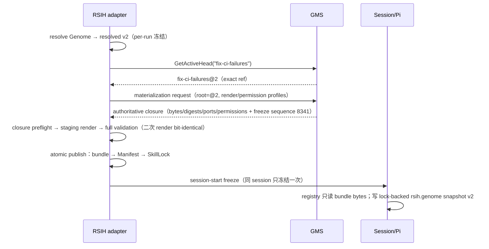
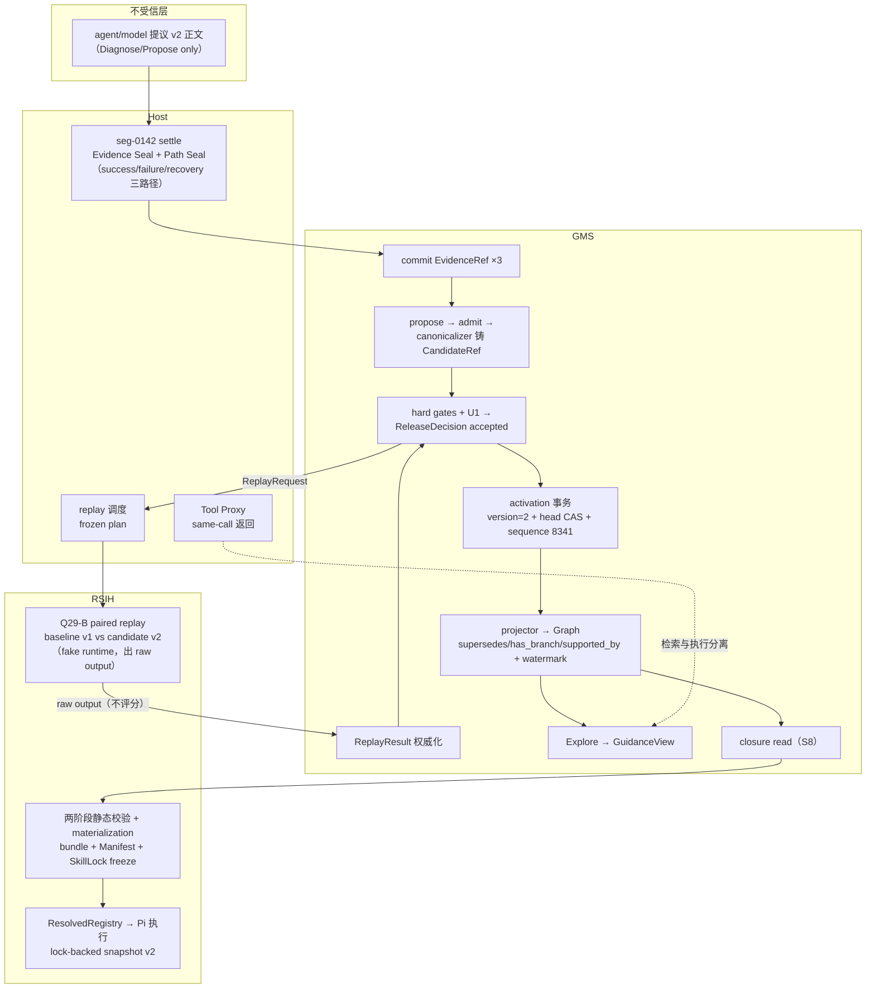
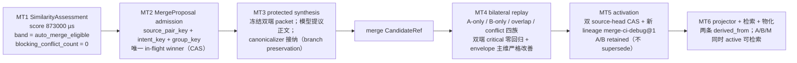
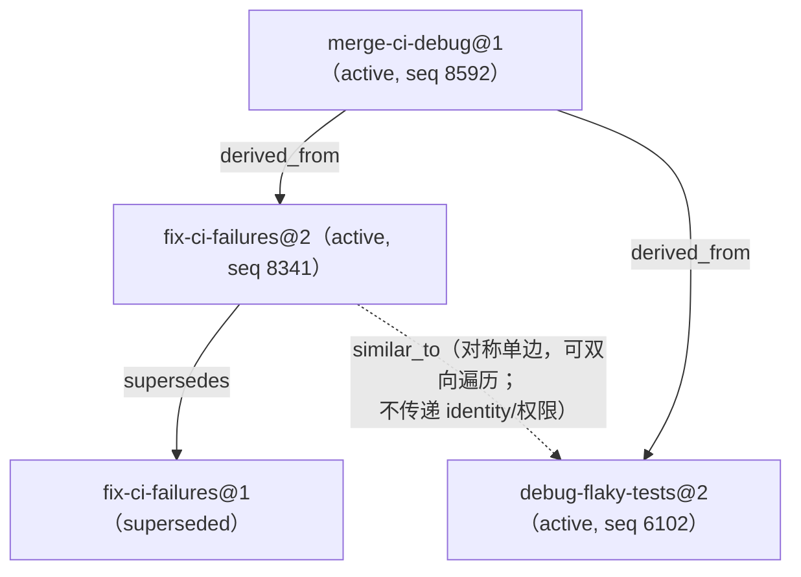

# RSIH Skill Evolution 导读：Genome 与 GMS Skill 生命周期的协作（含完整演化示例）

```yaml
document_status: explanatory
schema_version: rsih-skill-evolution.guide.v1
system_contract: ./system-contract.md
module_specs: [./rsi-harness.md, ./graph-memory-service.md, ./pi-group-chat-host.md]
implementation_plan: ./implementation-plan.md
language: zh-CN
```

> 本文是**导读与示例文档，非 normative**：把四份规范（Contract、RSIH、GMS、Host）中关于 Genome 生命周期与 GMS Skill 生命周期的协作方式串成一个可读的整体，并给出一个端到端的 skill 演化示例。所有 digest、ID、数字均为**示意**（digest 截断显示），以各 normative 规范为准；冲突时以 Contract 为准。

---

## 1. 系统总览：三模块 + 一契约

整个系统是 contract-first 的：`system-contract.md` 是唯一权威协议，定义 20 个共享 DTO、全局不变量（Q1–Q37/M1–M9/U1–U2/C1–C8）、端到端状态机、评估策略与封闭失败语义；三个模块规范只描述各自如何消费契约，不得复制或重定义共享 schema。



**权威边界一句话**：模型只可 Diagnose/Propose；Host 拥有封存与调度；GMS 拥有内容与演进治理的全部 ledger；RSIH 拥有物化与执行。任何一方不得越界写他方权威记录。

---

## 2. Genome 是什么

Genome 是 RSIH 中"一个 agent 运行环境的完整可分发配置包"——Pi coding agent 的不可变 Core + Genome 配置层 = 可运行的 harness。名字是生物隐喻：harness 的"基因"。

```text
~/.rsih/genomes/<name>/
  genome.json               # v3 manifest：genome_id + base + components[]
  components/<id>.json      # 12 个组件，字段所有权互斥
  contracts/<id>.dev.md     # 每组件契约
  skills/<skill>/SKILL.md   # file-backed skill
  extension/*.ts            # 随包扩展
```

**Genome 生命周期（RSIH 私有，配置轨道）**：



关键语义：
- **inherit-by-default 三态合并**：字段缺省→继承（最终 Pi 默认）；`null`→显式重置；有值→覆盖。
- **配置身份 ≠ 内容身份**：`genome_id` 不证明任何 skill 的 artifact bytes——这是与 GMS 协作的分水岭。

---

## 3. Legacy：没有 GMS 时的 skill 生命周期

在 GMS 集成之前，skill 只是 Genome 12 组件中 `skills` 组件里的条目（inline `{name, description, content}` 或 file-backed `{source}`，上限 16 个），整个生命周期发生在文件系统里：

| 环节 | Legacy 机制 | 缺口 |
|---|---|---|
| 生成 | 手写 bundle / GEE 交互式从 session 历史挖掘（决策表 + 证据门槛 + plan-approval 人审） | 提案无 ledger、无 provenance |
| 修改 | 直接编辑文件 / `applyHarnessPatch` 的 `upsert_skill`/`remove_skill` 原语（加载期合并机制） | 无版本、无历史、无回滚 |
| 验证 | 加载期 schema 校验（`validateHarnessGenome` + 组件所有权互斥 + `rsih genome validate`） | 只有格式正确性，无语义/证据/replay 校验 |
| 评估 | **不存在机制化评估**——只有 GEE 计划人审 + validate gate + 用户运行后肉眼观察 | 改坏 skill 没有任何东西会拦住 |
| 执行 | inline `load_skill` / file-backed `resources_discover` / ambient 三轨并存；resume 从 `rsih.genome` snapshot 恢复（不验 digest，内容可漂移） | 无 exact identity、无 session 冻结 |

这套机制被规范（RSIH §2）完整冻结为 **`legacy_unlocked` 兼容层**：可继续运行，但其输出不得作为 v1 Skill Evolution 的 replay/materialization evidence；session snapshot 必须迁移到 lock-backed 才能进 v1 执行/replay。

---

## 4. GMS Skill Evolution 协议核心

### 4.1 "进化"的含义

Skill 以**不可变 artifact revision** 的形式演进：每次内容变化 = 新 revision，必须走完整受保护管道。没有"原地修改"，只有"新版本替代旧版本并保留全部历史"。



### 4.2 身份体系（一切协作的地基）

| 对象 | exact identity | 说明 |
|---|---|---|
| `SkillArtifactRef` | `(lineage_id, version, artifact_digest)` | released、可执行；lineage kind 永不改变 |
| `CandidateArtifactRef` | `(candidate_id, body_digest)` | 未 release、不可执行、不可物化 |
| Canonical bytes | UTF-8 无 BOM + RFC 8785 JCS + SHA-256 | hashed core 只允许整数 JSON number |
| `MaterializationManifest` | `(materialization_id, manifest_version, manifest_digest)` | Contract §6.2.1（CTR-001）冻结 |
| `SkillLock` | `lock_digest`（preimage = DTO 全字段去掉自身） | 同 session 只冻结一次 |

**全系统禁止**：以 `latest`、裸名称、Graph node ID、别名执行/物化/释放——一律 fail closed（`NON_EXACT_REF`）。

### 4.3 三种封闭 kind

- `procedure`：稳定操作流程（steps + pre/postconditions + closed failure actions）
- `step_guidance`：因果上下文 + 原子 branches（每个 branch 固定为 when → action → future）
- `composite`：exact children DAG + named JSON-Schema ports + bounded retry + failure handlers + orchestration permissions；改任何 child ref 必须新 revision + whole-Composite replay

### 4.4 评估与释放（GMS 独占权威）

- **Hard gates**（任一失败不可被 utility 覆盖）：schema/digest、exact refs、required extensions、authority/provenance、evidence committed、permission ≤ Host cap、kind/lineage、ports/DAG/retry、fixture completeness、source-head freshness、zero safety violations、zero critical regressions、merge conflict closure（适用时）
- **U1 constrained Pareto**：整数五维 utility vector——`task_success_count` / `critical_branch_pass_count` / `recovery_success_count`（maximize）、`inconclusive_case_count`（minimize）四个主维**相对 reference envelope 全部不差且至少一维严格改善**；`execution_cost_units` 只受 versioned budget 约束，**cost 下降本身不构成 release 理由**；比例比较必须整数交叉乘法，溢出即 `UTILITY_ARITHMETIC_OVERFLOW` fail closed
- **Candidate 不可自评**：评估输入只能来自 protected replay；RSIH/Host 的"基础设施成功"不等于"语义通过"

### 4.5 普通提案状态机（Contract §9.1）



`withdrawn` 只允许在 candidate 进入 protected validation 前；**任何终态不可重开**，恢复 = 新 proposal/candidate attempt。

---

## 5. 两条生命周期的配合

### 5.1 总原则

| | Genome 生命周期 | GMS Skill 生命周期 |
|---|---|---|
| 管理对象 | **配置**（prompt/工具/模型/skill 声明） | **内容**（canonical artifact bytes） |
| 权威归属 | RSIH 私有，文件系统演化 | GMS 权威 ledger，append-only |
| 身份形态 | `genome_id` + 组件 manifest | `(lineage_id, version, artifact_digest)` |
| 冻结粒度 | per-run resolvedGenome、per-session SkillLock | revision 不可变 + active head CAS |

两个生命周期**只通过共享 DTO + exact ref 单向衔接**，在两个交叉点上完成身份转换与字节绑定：



- **交叉点 ①（声明→exact ref）**：Genome 从此不再"是"skill 的来源，只"声明需要哪些 skill"；声明被解析到 GMS 权威 active head 后，执行 bytes 只来自物化 bundle。
- **交叉点 ②（closure→lock）**：物化输入只来自 GMS 权威 active head/artifact store（不依赖 Graph 追平）；RSIH 产出 content-addressed bundle + SkillLock，同 session 只冻结一次。

### 5.2 一次 v1 会话启动的完整时序



### 5.3 Freeze 语义：两个生命周期互不打扰的分水岭（RSIH §3.4）

SkillLock 在 session start 成功发布后**冻结**。此后：

- GMS 的 active head 前移、Graph 变化、Genome 文件被编辑、ambient 资源变化——**均不得改变该 session 的 bound ref/bytes**
- 需要 new revision → **新 session + 重新 materialize**；禁止旧 session 内"refresh latest"
- 若历史 lock 仍可解析且 digest 校验通过，旧 session 按原 bytes 继续跑；不可解析/digest mismatch → fail closed，**不得降级到当前 head**

### 5.4 变化传播矩阵

| 变化事件 | 对运行中 session | 对下一次 run | 处理方 |
|---|---|---|---|
| GMS 激活新 revision（head 前移） | 不受影响：locked bytes 继续跑 | 新 session → 重新解析声明 → 新 materialization → 新 lock | GMS 出 activation event；RSIH 出新 lock |
| Head 在 closure read 与 freeze 之间变化 | 本次 staging 作废，不产生 lock（`MANIFEST_SEQUENCE_STALE`）；可换 materialization identity 重试 | 同左 | RSIH fail closed |
| 用户编辑 Genome 文件（配置） | 不受影响（resolvedGenome per-run 冻结） | 重新 resolve；skill 声明不变则物化幂等复用 | RSIH |
| 用户编辑 Genome 内 skill 正文（legacy 路径） | 旧 session 照跑旧 bytes | `legacy_unlocked`：拒绝进 v1 执行/replay；必须走 GMS pipeline 变成正式 revision | RSIH 拒绝 / GMS 管演进 |
| 种子更新（上游 Genome 新版） | 不受影响 | 四态策略：未编辑→自动刷新；编辑过→只警告不覆盖 | RSIH |
| GMS deactivate 某 revision | lock 可解析照跑（历史 exact ref 保留）；默认检索不再返回 | 无 active head → materialization fail closed | GMS / RSIH |
| Candidate 出现（未 release） | 不可绑 S-slot、不可物化；只在 Host 调度的 replay packet 中可见 | 同左（`CANDIDATE_NOT_EXECUTABLE`） | RSIH |
| 撞名/双曝光/ambient 混入 | `INLINE_BUNDLE_COLLISION` / `FILE_BACKED_PATH_MUTABLE` / `RESOURCE_DOUBLE_EXPOSURE` / `AMBIENT_REPLAY_FORBIDDEN` → fail closed，不按加载顺序选 winner | 同左 | RSIH registry |

### 5.5 配合的其余要点

- **Snapshot v2 迁移（RSI-205 已实现）**：`rsih.genome` session 条目从"保存 resolved v2 JSON + 可变 source path"迁移为 lock-backed——payload 只记 lock digest、registry digest、manifest exact identity、resolved source list、activation sequence、session id、baseDirectory policy；legacy 无 lock 字段条目分类 `legacy_unlocked`，永不自动升级。
- **权限上互相不可见**：GMS 不知道 Genome 概念（genome_id/组件/契约/seed）；RSIH 对 GMS 的 proposal/decision/activation API 是 no-op boundary guard（MT1/2/3/5 误路由 → 零 shared writes 直接拒绝）。
- **当前落地状态**：conformance Wave 0 产物齐备（48 fixture case、reason/tool/materialization policy、shared/state schema、S1 与 S2–S4 集成 runner）；三仓 adapter 与部分 domain 已实现（GMS `internal/skillevolution/`、Host `contract/toolproxy/segment/explore/replay`、RSIH `src/skill-evolution/` 含 RSI-205 的 registry/snapshot/pi-adapter）；v1 为 **opt-in 入口**（legacy `runPiCli` 原路径不动）；`run_s5_s9.py` / `run_mt1_mt6.py` 尚未落地——S5–S9 与 MT1–MT6 端到端 tracer 未贯通，未过 gate 的 capability 一律 disabled/fail closed。

---

## 6. 完整示例：`fix-ci-failures` skill 从 v1 到 v2 的演化

以下用一个具体场景把全管道走一遍。所有 ID/digest 为示意（digest 截断显示）。

### 6.0 背景

- 团队用 RSIH（Genome `dev-std`）做日常编码。现有 skill lineage **`fix-ci-failures`**（kind `step_guidance`），v1 已 active：
  `fix-ci-failures@1 = {lineage_id: "fix-ci-failures", version: 1, kind: "step_guidance", artifact_digest: "sha256:3c9f…"}`
- v1 的问题：只覆盖"编译错误"一种分支，遇到 flaky test 和 runner 超时时 agent 行为不稳定，用户反复纠正。

### 6.1 Host：Segment 封存（S3）

Room `room-7f3a` 中，agent 在用户引导下完整处理了一次 CI 失败：先遇到 flaky test（单跑确认后重跑通过），再遇到真实编译错误（定位修复），期间一次 runner 超时被正确处理。Host 将这段交互封存：

```jsonc
// SegmentRef（Contract §7.5）
{
  "schema_version": "host.segment-ref.v1",
  "room_id": "room-7f3a",
  "segment_id": "seg-0142",
  "segment_version": 1,
  "segment_digest": "sha256:a1b2…",
  "evidence_seal_ref": { "id": "seal-ev-0142",  "version": 1, "digest": "sha256:9f8e…" },
  "path_seal_ref":   { "id": "seal-path-0142", "version": 1, "digest": "sha256:7d6c…" }
}
```

Conversation Path Seal 固定三条路径：`success`（flaky 确认后重跑通过）、`failure`（编译错误的前缀）、`recovery`（超时后的恢复动作）。terminal Decision Checkpoint `ckpt-0142` 一并封存。

### 6.2 GMS：证据提交（`IngestEvidence`）

GMS protected evidence committer 验证 Host seal、scope、provenance 后原子 commit，铸造三个 `EvidenceRef`（Contract §7.7）：

| evidence_id | evidence_kind | commit_state |
|---|---|---|
| `ev-ci-success` | `success_path` | `committed` |
| `ev-ci-failure` | `failure_path` | `committed` |
| `ev-ci-recovery` | `recovery_path` | `committed` |

### 6.3 GMS：提案与候选（`SubmitSkillProposal` → `BindCandidate`）

Agent（model initiator）基于封存证据提出修订 v2。Admission 检查通过后（Segment settled、evidence committed、parent exact、dedup key 无冲突、permission 未越界）：

```jsonc
// SkillProposal（Contract §7.9，节选）
{
  "schema_version": "gms.skill-proposal.v1",
  "proposal_id": "prop-ci-2a9f",
  "proposed_kind": "step_guidance",
  "requested_operation": "revise_lineage",
  "source_segment_refs": [ /* seg-0142 */ ],
  "evidence_refs": [ /* ev-ci-success, ev-ci-failure, ev-ci-recovery */ ],
  "parent_skill_refs": [ /* fix-ci-failures@1 */ ],
  "origin": { "initiator_type": "model", "initiator_ref": "agent-ci@session-88", "request_ref": "req-4471" }
}
```

Protected canonicalizer 将模型建议正文规范化（JCS、integer-only、closed schema、branch provenance 全部指向 committed evidence），铸造候选：

```jsonc
// CandidateArtifactRef（Contract §7.4）
{ "schema_version": "gms.candidate-artifact-ref.v1",
  "candidate_id": "cand-ci-2a9f", "kind": "step_guidance",
  "body_digest": "sha256:9e12…", "origin_type": "skill_proposal",
  "origin_ref": { "id": "prop-ci-2a9f", "version": 1, "digest": "sha256:44aa…" } }
```

候选正文（`step_guidance` body，Contract §8.3，节选）：

```jsonc
{
  "causal_context": {
    "summary": "river2_0 的 CI 失败有三类来源：编译错误、flaky test、runner 超时",
    "claim_refs": [ /* 指向封存证据 */ ] },
  "branches": [
    { "branch_id": "b-compile", "when": { /* 日志含编译错误 */ },
      "action": { "guidance": "读首个编译错误 → 定位文件 → 最小修复 → 重跑受影响包", "failure_action": "stop", "evidence_refs": [ /* ev-ci-failure */ ] },
      "future": { "expected_outcome": "编译错误消除", "critical_steps": [ /* … */ ], "final_task_impact": "…" } },
    { "branch_id": "b-flaky", "when": { /* 同一测试偶发失败 */ },
      "action": { "guidance": "单跑该测试 3 次确认 flaky → 重跑 CI；若再失败转入 b-compile", "failure_action": "request_human", "evidence_refs": [ /* ev-ci-success */ ] },
      "future": { "expected_outcome": "CI 绿且测试真实通过", "critical_steps": [ /* … */ ], "final_task_impact": "…" } },
    { "branch_id": "b-timeout", "when": { /* runner 超时 */ },
      "action": { "guidance": "读慢测试报告 → 拆分或标记 skip → 重跑", "failure_action": "mark_inconclusive", "evidence_refs": [ /* ev-ci-recovery */ ] },
      "future": { "expected_outcome": "总时长回到预算内", "critical_steps": [ /* … */ ], "final_task_impact": "…" } }
  ]
}
```

状态推进：`proposed → admitted → candidate_bound → validating`。注意：**模型提议的正文在被 canonicalizer 接纳前不是权威记录；candidate 不可执行、不可 Explore、不可物化**。

### 6.4 Paired replay（S4：GMS 冻结请求 → Host 调度 → RSIH 执行）

GMS `CreateReplayRequest`（Contract §7.10，节选）：

```jsonc
{ "schema_version": "gms.replay-request.v1",
  "replay_request_id": "rr-ci-007",
  "candidate_ref": { /* cand-ci-2a9f */ },
  "baseline_skill_refs": [ /* fix-ci-failures@1（当前 active，即 reference envelope 的 baseline）*/ ],
  "fixture_set_refs": [ /* fixset-ci-v3：来自 seg-0142 的 sealed 三族 + 历史积累 */ ],
  "segment_refs": [ /* seg-0142 */ ],
  "replay_profile_ref": { "id": "gms.replay-profile", "version": 2, "digest": "sha256:…" },
  "runtime_adapter_ref": { "id": "rsih.q29b-fake-runtime", "version": 1, "digest": "sha256:…" },
  "mode": "causal_evaluation" }
```

Host 验证 schedulability 后冻结 frozen plan（fixture 顺序、seeds、adapter 版本、permissions、capture policy），把 baseline/candidate 两个 run 派发给 RSIH HarnessRunner。RSIH 在 Q29-B sealed fixture + deterministic fake runtime（虚拟 clock/random、禁网络）中**隔离执行两侧**，产出私有 raw execution output——**不评分、不铸 ReplayResult**。

### 6.5 GMS：canonicalize + 评估（S5 前半）

GMS 校验 Host correlation 与 RSIH raw output，铸造权威 `ReplayResult`（Contract §7.11）。Fixture 覆盖必须包含全部三族：

| Fixture family | cases | baseline v1 passed | candidate v2 passed | critical_regression |
|---|---:|---:|---:|---:|
| success（含 flaky 确认） | 15 | 12 | 15 | 0 |
| failure（编译错误） | 10 | 6 | 9 | 0 |
| recovery（超时恢复） | 8 | 5 | 7 | 0 |

聚合 utility vector（五维整数）与 U1 判定（对照 reference envelope = baseline v1）：

| 维度 | 方向 | baseline v1（envelope） | candidate v2 | 判定 |
|---|---|---:|---:|---|
| `task_success_count` | maximize | 23 | 31 | 严格改善 ✓ |
| `critical_branch_pass_count` | maximize | 18 | 22 | 严格改善 ✓ |
| `recovery_success_count` | maximize | 5 | 7 | 严格改善 ✓ |
| `inconclusive_case_count` | minimize | 4 | 1 | 严格改善 ✓ |
| `execution_cost_units` | budget ≤ 2000 | 1100 | 1250 | 未超预算 ✓（cost 不参与"严格改善"判定） |

Hard gates 逐项通过（schema/digest、exact refs、required extensions、authority/provenance、evidence committed、permission ≤ Host cap、kind/lineage、ports/branches/failure actions、fixture completeness、source-head freshness、zero safety violations、zero critical regressions）。U1：四个主维**全部不差且全部严格改善** → `ReleaseDecision`：

```jsonc
{ "schema_version": "gms.release-decision.v1",
  "decision_id": "dec-ci-0551", "candidate_ref": { /* cand-ci-2a9f */ },
  "hard_gate_results": [ /* 13 项全 passed */ ],
  "outcome": "accepted", "reason_codes": [] }
```

### 6.6 GMS：原子激活（S5）

Release transaction 一次原子完成（任一步失败零部分发布）：

1. 分配 lineage version = **2**（不可复用、单调）；
2. 写 Candidate→Released mapping，`body_digest_equal=true`（released bytes 与 candidate bytes 逐字节相同，envelope audit metadata 不进 body digest）；
3. active-head CAS：expected head = `fix-ci-failures@1` → 新 head = `@2`；
4. 追加 `ActivationEvent`（全局 `activation_sequence = 8341`）；
5. 写 outbox；
6. proposal 终态 `released`。

```jsonc
// ActivationEvent（Contract §7.13，节选）
{ "schema_version": "gms.activation-event.v1",
  "activation_sequence": 8341, "event_type": "activate",
  "lineage_id": "fix-ci-failures",
  "skill_ref": { /* fix-ci-failures@2, artifact_digest: sha256:9e12… */ },
  "previous_active_ref": { /* fix-ci-failures@1 */ },
  "release_decision_ref": { "id": "dec-ci-0551", "version": 1, "digest": "…" },
  "candidate_ref": { /* cand-ci-2a9f */ },
  "body_digest_equal": true,
  "outbox_key": "sha256:…", "extensions": {} }
```

**注意 Graph 不在这个事务里**——投影是异步的。

### 6.7 GMS：异步投影（S6）

Projector 按连续 activation sequence 消费 outbox，原子提交 Graph mutation + cursor + watermark：

```text
新增节点： fix-ci-failures@2（active）、branch 节点 b-compile / b-flaky / b-timeout
新增边：   fix-ci-failures@2 --supersedes--> fix-ci-failures@1   （activation structural）
          fix-ci-failures@2 --has_branch--> b-*                  （artifact structural）
          b-compile --supported_by--> ev-ci-failure              （evidence-assessed）
          b-flaky  --supported_by--> ev-ci-success
          b-timeout --supported_by--> ev-ci-recovery
保留节点： fix-ci-failures@1（superseded，历史不删除）
watermark: projected_through_activation_sequence = 8341
```

### 6.8 检索（S7）：另一个 agent 查询

新 session 里 agent 问 CI 问题，Pi 发起 `memory_explore` tool call → Host Tool Proxy 同步转发 → GMS deterministic lexical + graph ranking → **同一次 Pi tool call** 返回 exact `ToolProxyResult`，内含 `ExploreResult`（节选）：

```jsonc
{ "schema_version": "gms.explore-result.v1",
  "explore_session_id": "es-8841",
  "skill_results": [{
    "result_type": "skill",
    "skill_ref": { /* fix-ci-failures@2（默认只返回 current active；@1 已 superseded 不出现）*/ },
    "rank_score_micros": 812_000,
    "guidance_view": {
      "source_skill_ref": { /* fix-ci-failures@2 */ },
      "included_branch_refs": ["b-compile", "b-flaky", "b-timeout"],
      "omitted_branch_refs": [],
      "content": "…（按 render profile 从 canonical artifact 派生的指引正文）…",
      "truncated": false, "view_hash": "sha256:5f3e…" },
    "artifact_identity_citation": { "skill_ref": { /* @2 */ } },
    "evidence_citations": [ /* identity 与 evidence citation 分离 */ ] }],
  "served_fences": { "evidence_fence_digest": "sha256:…", "skill_fence_digest": "sha256:…" },
  "budgets": { "total_cap": 10, /* … */ "total_used": 1 },
  "truncation_reason_codes": [], "omissions": [] }
```

检索 ≠ 执行：GuidanceView 只是只读视图，不代表 skill 已绑定 S-slot 或已物化。

### 6.9 RSIH：物化与会话冻结（S8）

用户启动新 RSIH session（Genome `dev-std` 的 skills 组件声明了 `fix-ci-failures`）。v1 adapter 执行：



产出的 Manifest（Contract §6.2.1 v1.1 闭合形态，节选）与 SkillLock（Contract §7.20）：

```jsonc
// MaterializationManifest
{ "schema_version": "rsih.materialization-manifest.v1",
  "materialization_id": "mat-ci-5c31",
  "manifest_version": 1,
  "skill": { "lineage_id": "fix-ci-failures", "version": 2, "kind": "step_guidance" },
  "root_skill_refs": [ /* fix-ci-failures@2 */ ],
  "transitive_skill_refs": [ /* @2（step_guidance 无 children，closure = 自身）*/ ],
  "render_profile_ref": { "id": "rsih.render-profile", "version": 1, "digest": "sha256:…" },
  "permission_profile_ref": { "id": "rsih.permission-profile", "version": 1, "digest": "sha256:…" },
  "producer": { "producer_id": "rsih", "producer_version": 1 },
  "files": [ { "path": "skills/fix-ci-failures/SKILL.md",
               "size_bytes": 3141, "content_digest": "sha256:c0de…" } ],
  "file_count": 1, "total_bytes": 3141,
  "bundle_digest": "sha256:ee11…",
  "created_from_activation_sequence": 8341 }
// manifest_digest = SHA-256(JCS(上式)) ≠ bundle_digest（三层 identity 互不替代）

// SkillLock
{ "schema_version": "rsih.skill-lock.v1",
  "session_id": "sess-rsih-9d21",
  "materialization_ref": { "id": "mat-ci-5c31", "version": 1, "digest": "<manifest_digest>" },
  "root_skill_refs": [ /* @2 */ ],
  "locked_closure": [ { "skill_ref": { /* @2 */ }, "artifact_digest": "sha256:9e12…",
                        "materialized_path": "skills/fix-ci-failures/SKILL.md",
                        "file_digest": "sha256:c0de…" } ],
  "activation_sequence_at_freeze": 8341,
  "lock_digest": "sha256:66ff…" }
```

此后该 session 的 `load_skill`、slash command、Composite child 解析全部回到 registry 同一 entry，每次读 bytes 复核 file digest。**legacy 的 inline/file-backed 双轨被收敛为唯一 bundle 源；撞名 fail closed。**

### 6.10 演进继续：v3 到来

数周后该 skill 再次演进（v3 在 sequence 8592 激活）：

- **运行中 session（锁定 @2）**：lock 仍可解析、digest 校验通过 → **按 @2 bytes 继续跑完**，GMS 演进不撕裂它；若 bundle 丢失/digest mismatch → fail closed，禁止降级到 @3。
- **新 session**：声明解析 → `GetActiveHead` 返回 @3 → 新 materialization → 新 lock（freeze sequence 8592）。
- **Graph**：@1/@2 节点永久保留，`@3 --supersedes--> @2`，历史审计随时可查。

### 6.11 示例全程鸟瞰



---

## 7. Merge 扩展示例（MT1–MT6）：两个相近 skill 的合并

普通修订之外，v1 支持二元 `step_guidance` 合并。沿用上文：

**场景**：`fix-ci-failures@2` 与另一个 active skill `debug-flaky-tests@2` 覆盖面高度重叠，检索时经常同时命中。



要点（对照 Contract §9.4 / §5.5）：

- **MT1**：assessment 是版本化、不可变的（`score_micros` 整数定标 + policy ref）；`below_suggestion` 不得自动 admission，`merge_review` 需人工/额外证据 gate，`auto_merge_eligible` 仅在无 blocking conflict 且 compatibility gates 全过时可自动 admit。
- **MT2**：dedup 三 key——`source_pair_key`（规范排序的 exact ref 对）、`intent_key`、`proposal_group_key`；同 group 只允许一个 admitted/in-flight winner，后来者 `duplicate` 并指向 canonical winner。相同 lineages、不同 revision **不是** exact duplicate，旧 attempt 按 freshness 变 `stale`（不自动 rebase）。
- **MT3**：冲突必须 closed resolution。本例两条非阻塞冲突：`outcome_divergence → preserve_as_branches`（两端的判定分支并存）、`future_path_divergence → narrow_applicability`；0 条 blocking，才允许继续。
- **MT4**：A fixture 的 baseline 是 A、B fixture 的 baseline 是 B、overlap 按 policy 选 best applicable source；**A、B critical slices 任一回归即拒绝**；assessment score 不能替代 replay。
- **MT5**：激活事务同时 CAS 两个 source head（A@2、B@2 必须仍是当前 active）；任一变化 → `stale`，无部分激活。
- **MT6**：新 lineage `merge-ci-debug@1`，Graph 上恰有两条 `derived_from`；**A/B retained active**——检索时 A/B/M 同时命中是合法结果，不得自动隐藏 sources；后续 M 的同 lineage revision 可 `supersedes` 旧 M，但永不 `supersedes` A/B。

Graph 效果：



---


全流程：从群聊到“这个 skill 更好”的结论

 ```mermaid
   sequenceDiagram
       participant Room as 群聊 Room
       participant H as Host
       participant G as GMS
       participant R as RSIH

       Note over Room,H: ① 日常并行：Host 切 Segment、封 seal（唯一合法回测来源）
       Room->>H: Segment settle<br/>Evidence Seal + Path Seal(success/failure/recovery) + Checkpoint
       H->>G: ② IngestEvidence → committed EvidenceRef
       Note over Room: ③ agent/人/model 发起修订提案
       Room->>G: SkillProposal(revise_lineage, parent=@v1)
       G->>G: ④ admission → protected canonicalizer → CandidateRef
       G->>G: ⑤ 静态验证 → CreateReplayRequest<br/>(candidate + baseline@v1 + 三族 fixture)
       G->>H: ⑥ ReplayRequest（请求调度）
       H->>H: ⑦ 校验 schedulability → 冻结 frozen plan
       H->>R: ⑧ 派发 baseline/candidate 两个 run
       R->>R: ⑨ Q29-B paired 执行（fake runtime，两侧隔离）→ raw output
       R->>H: ⑩ 私有 raw output（不评分）
       H->>G: ⑪ correlation
       G->>G: ⑫ canonicalize ReplayResult → hard gates + U1 → ReleaseDecision
       G->>G: ⑬ accepted → 原子激活(version=2, head CAS, ActivationEvent)
       G-->>Room: ⑭ 投影后，后续检索返回新版本 GuidanceView
 ```

 逐步展开（每步谁拥有权威、产出什么）

 ① 原料积累（与群聊日常并行，Host 权威）
 Host 维护 Interaction DAG（消息/工具调用/Delivery 的因果链），按策略把对话切成 Segment；每个 Segment settle 时原子封存：Evidence Seal（事件序列+payload digests）+ Conversation Path Seal（protected path
 extraction 发现的 success/failure/recovery 三类路径）+ terminal Checkpoint。
 关键规则：这是未来所有 replay 的唯一合法来源。Host §2.7 明令禁止事后“重新拼接当前 transcript”——群聊后面继续聊，也不会污染已封存的输入。

 ② 证据入库（GMS 权威）
 GMS IngestEvidence 验证 seal/scope/provenance 后 commit，铸造 EvidenceRef（commit_state=committed）。staged/未封印的输入铸不了 ref，也进不了后续管道。

 ③ 发起提案（model/agent/human，只能 Propose）
 比如：某次群聊里 agent 在用户纠正下走出了好路径。任何发起者提交 SkillProposal：requested_operation=revise_lineage、parent_skill_refs=[当前 active skill@v1]、evidence_refs=[②的committed证据]、
 source_segment_refs=[settled segment]。

 ④ Admission + Candidate（GMS protected）
 GMS 验：Segment settled、evidence committed、parent exact、dedup key 无冲突、permission 未越界 → admitted → protected canonicalizer 把建议正文规范化（JCS/integer/closed schema/branch provenance 全指向
 committed evidence）→ 铸不可变 CandidateArtifactRef。模型自此失去对正文的控制权。

 ⑤ 静态验证 + 冻结 ReplayRequest（GMS 权威）
 validation ledger 记录静态 gates；CreateReplayRequest 冻结对比的一切要素：

 ```jsonc
   { "candidate_ref": <④的 CandidateRef>,
     "baseline_skill_refs": [<当前 active 的 @v1>],   // reference envelope 的基线
     "fixture_set_refs": [<来自①的 sealed path 三族 fixture>],
     "segment_refs": [<settled Segment>],
     "replay_profile_ref": <exact versioned>,
     "runtime_adapter_ref": <exact versioned>,
     "mode": "causal_evaluation" }
 ```

 ⑥→⑦ Host 调度（Host 权威，但不评分）
 Host 校验：schema/digest、mode、Segment settled、seal 可验证、fixture 覆盖与 sealed path 一致、无 latest/裸名、adapter/profile 可用、permission 不超 Host cap、幂等 key 无冲突。
 注意一个细节：Host 不负责检查 baseline 是否还是 active head——那是 GMS 的 hard gate（source-head freshness），Host 只透传 expectation。通过后冻结 frozen plan：两侧 run 身份、fixture 执行顺序、sealed 事件/路径
 输入、adapter/profile 版本、env allowlist、permissions、timeout/retry、capture policy。Plan 冻结后，retry 也不得改变。

 ⑧→⑩ RSIH paired 执行（RSIH 权威，但无决定权）
 Q29-B 方案：
 - 相同：fixture 序列、adapter/profile/fake runtime 版本、初始状态、permissions、clock/random seeds、capture policy；
 - 隔离：baseline 和 candidate 各自独立 workdir scratch、cache、session、side-effect sink；每次能力调用期间 Date.now/Math.random/process.env/fetch 被 throwing guards 毒化——Genome 和 ambient 资源明令不得进入；
 - 全族覆盖：success/failure/recovery 三族必须全跑，不得因 candidate 在 success path 通过而跳过 failure/recovery；任何族缺失 = incomplete，不得伪装成功；
 - 产出私有 immutable raw execution output（captured events、assertion observations、output digest）——这不是 ReplayResult，不含任何评分。

 ⑪→⑫ correlation + 权威化评估（GMS 权威）
 Host 关联两侧 attempt/输出 → GMS 校验 correlation 与 RSIH output，铸权威 ReplayResult（每族 fixture_outcomes：counts、critical regression、output digest + 五维整数 utility vector）。然后 evaluator：

 1. Hard gates 全过（schema/digest、exact refs、evidence committed、permission、fixture completeness、source-head freshness（激活前 head 变了→stale）、zero critical regressions…）——任一失败，utility 不得覆盖；
 2. U1 constrained Pareto：相对 reference envelope（= baseline@v1），四个主维（task_success / critical_branch_pass / recovery_success / inconclusive）全部不差且至少一维严格改善，cost 只受预算——仅 cost 改善不算
    ；
 3. 产出 ReleaseDecision：accepted / rejected / inconclusive。

 ⑬ 激活（GMS 权威，原子事务）
 仅 accepted 才进：version 分配（@2）+ Candidate→Released body equality 证明 + active-head CAS（expected=@v1，冲突→stale，零部分发布）+ ActivationEvent + outbox。Projector 异步更新 Runtime Graph + watermark。
 Graph 不在激活事务内。

 ⑭ 生效
 - 新 RSIH session：物化 @2、SkillLock 冻结；
 - 运行中 session：锁定 @1 bytes 继续跑完（GMS 演进不撕裂它）；
 - 群聊后续 memory_explore：默认只返回新 active 的 @2 GuidanceView（带 watermark）；@1 节点保留供历史审计。

 三个容易误解的点

 ┌────────────────────┬───────────────────────────────────────────────────────────────────────────────────────────────────────────────────────────────────────────┐
 │ 误解               │ 实际                                                                                                                                      │
 ├────────────────────┼───────────────────────────────────────────────────────────────────────────────────────────────────────────────────────────────────────────┤
 │ “回放群聊”         │ 回测对象是封存因果路径 + fake runtime，Room 本身继续运行；且 fixture 来自 seal 而非 transcript 拼接                                       │
 ├────────────────────┼───────────────────────────────────────────────────────────────────────────────────────────────────────────────────────────────────────────┤
 │ “跑一次成功就行”   │ 三族（success/failure/recovery）必须全跑；merge 还要 A-only/B-only/overlap/conflict 四族                                                  │
 ├────────────────────┼───────────────────────────────────────────────────────────────────────────────────────────────────────────────────────────────────────────┤
 │ “评估在 RSIH/Host” │ RSIH 只出 raw output、Host 只做 correlation——ReplayResult、hard gates、U1、ReleaseDecision 全部是 GMS 权威，模型/Host/RSIH 都不得参与评分 │
 └────────────────────┴───────────────────────────────────────────────────────────────────────────────────────────────────────────────────────────────────────────┘

 失败路径也是封闭的：任何一个 gate 挂掉 → closed reason code → candidate 进 rejected；head 中途变化 → stale（不自动 rebase，必须新 attempt）；基础设施失败（worker 挂了）→ Host 可 bounded retry（复用 frozen
 plan），但语义失败不得重跑成 pass。

 这套流程在 skill-evolution-guide.md §6 的 fix-ci-failures 例子里有一个带具体数字的完整走查（三族 fixture 15/10/8 cases、U1 五维对比、activation sequence 8341），可以直接对照阅读。
 
## 8. Legacy → v1 迁移要点

| Legacy 状态 | v1 要求 |
|---|---|
| Genome skill 正文 = 执行 bytes | 必须解析为 GMS exact active ref 后由物化 bundle 替代；inline/file-backed 双轨收敛，撞名 fail closed |
| `rsih.genome` snapshot 保存 resolved JSON + source path | lock-backed snapshot v2：只记 lock/manifest/registry digest；resume 投影前全链重验 |
| ambient 资源默认与 Genome 并存 | live profile 显式允许时须分域（non-Genome/non-replay namespace）；replay profile 必须关闭 ambient discovery |
| 无版本无历史 | v1 一切演进经 GMS ledger；Genome 文件编辑只影响下一次 run 的配置 |

## 9. 术语速查

| 术语 | 一句话定义 |
|---|---|
| Genome | RSIH 的可分发 harness 配置包（12 组件，inherit-by-default） |
| GEE | 从 session 历史交互式生成 Genome 的 harness-rsi Genome（`gee` 命令） |
| lineage / revision / active head | kind 不变的逻辑身份 / 不可变版本（version+digest）/ 当前可执行指针（CAS） |
| Candidate vs Released | 未释放不可执行（`candidate_id+body_digest`）/ 已激活（`lineage+version+artifact_digest`）；body digest 必须相等 |
| S-slot | MetaRSI 私有运行绑定点，只接受 released exact ref，session 冻结 |
| MaterializationManifest / SkillLock | RSIH 的物化清单（manifest exact identity）/ 会话锁（closure + freeze sequence） |
| Q29-B | sealed recorded fixture + deterministic fake runtime 的 replay 方案 |
| U1 constrained Pareto | 四主维全不差且至少一维严格改善 + cost 预算约束的整数释放判据 |
| ProjectionWatermark | 某投影已连续处理到的 activation sequence；Graph 是派生读模型 |
| `legacy_unlocked` | 无 lock 可验证的 legacy 路径分类：可运行，但拒绝 v1 执行/replay，永不自动升级 |